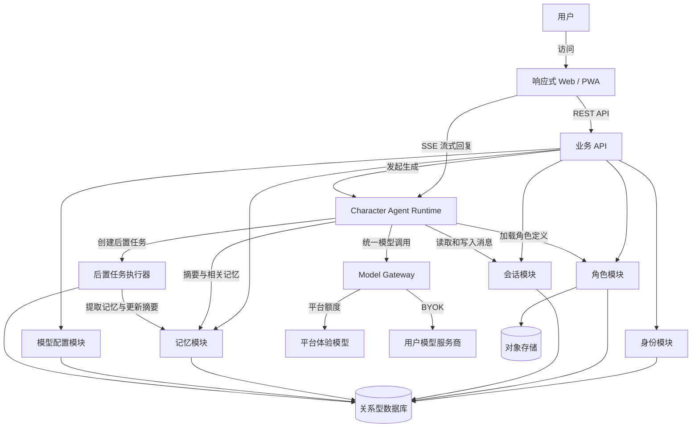
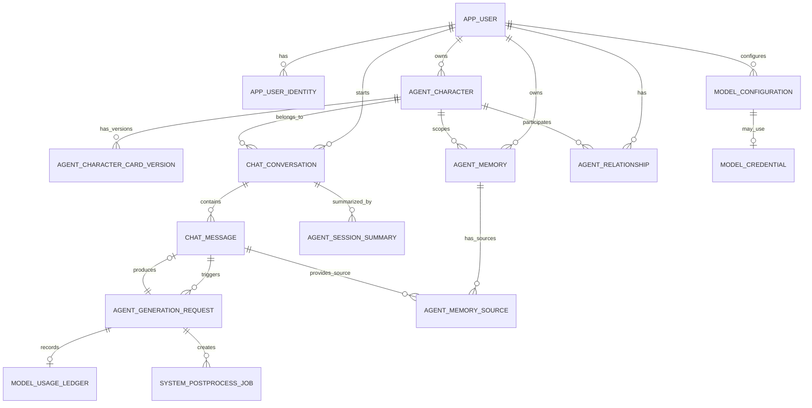
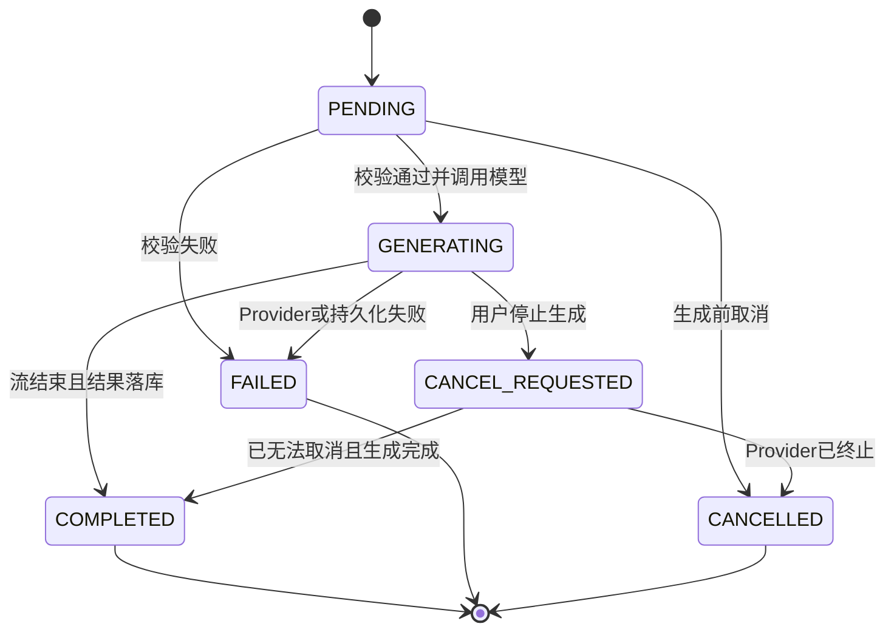
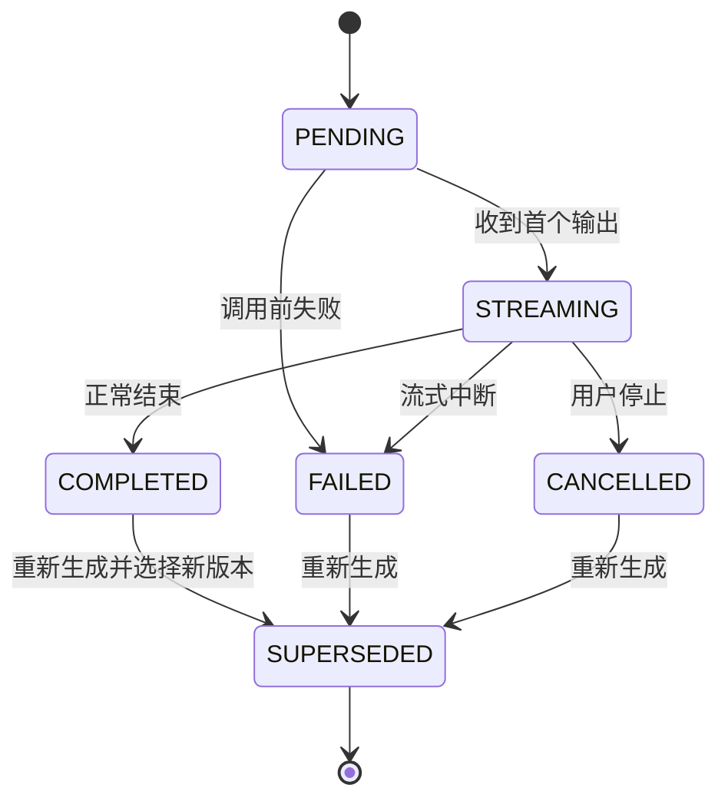
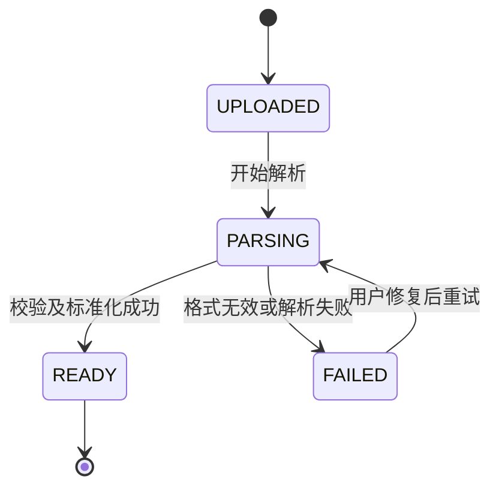
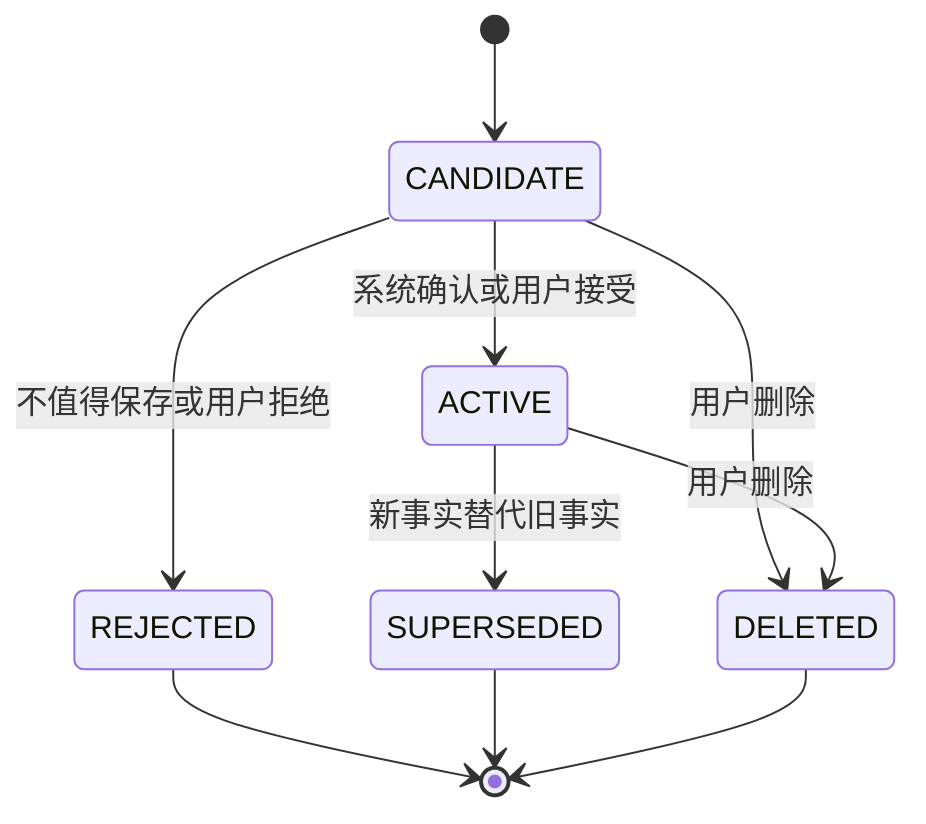
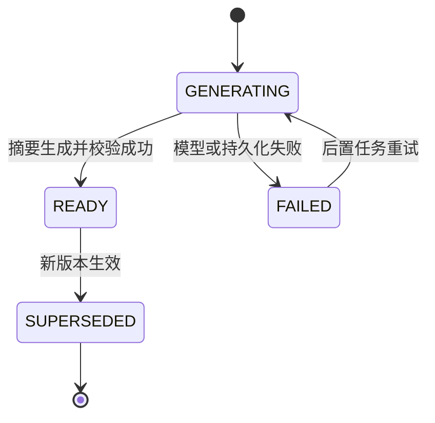
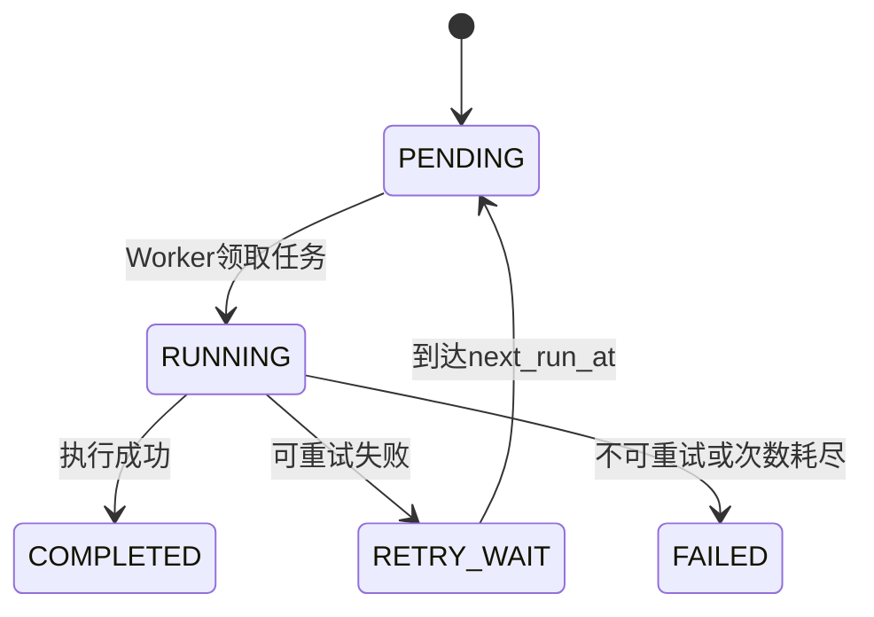

# v0.1.0 详细系统设计

> 本文作为 Agent 开工基线。
> **冻结**：系统职责、核心流程、领域对象、数据约束、状态机、Context 生命周期和 API 语义。
> **暂不冻结**：具体 ORM、记忆评分算法、向量方案、API Key 最终存储方式以及部分阈值。

Claude Code 分析仓库带来的关键借鉴是：

* 多种入口共用统一执行内核，而不是各自实现聊天逻辑；
* Prompt 是分层、动态装配的 Runtime，不是一个字符串模板；
* 原始会话、Session Memory、长期记忆、相关召回和 Compaction 分别解决不同问题；
* 召回少量相关记忆，而不是把全部记忆灌入上下文；
* 压缩旧上下文后，必须重新注入继续运行所需的稳定状态。

---

# 一、架构结论

## 1. 系统目标

系统每次生成回复时，必须为模型提供正确的：

```text
稳定身份
+
可恢复的过去
+
当前相关信息
```

最终体验目标：

1. 角色长期保持同一身份和人格；
2. 用户刷新、断线、长时间离开后仍可继续；
3. 角色能正确使用过去的重要信息；
4. 无关、错误或已删除的记忆不得污染回复；
5. 不同用户、不同角色之间绝不串数据。

## 2. 技术结构

采用：

```text
响应式 Web / PWA
        ↓
模块化单体后端
        ↓
Character Agent Runtime
        ↓
Model Gateway
        ↓
外部模型服务
```

基础设施：

* 一个关系型数据库；
* 一个对象存储；
* SSE 流式传输；
* 一个数据库驱动的轻量后置任务机制；
* 不拆微服务；
* 不部署独立消息队列；
* 不要求独立向量数据库。

## 3. 系统架构图



---

# 二、模块职责

| 模块            | 负责                            | 不负责               | 数据归属                                             |
| ------------- | ----------------------------- | ----------------- | ------------------------------------------------ |
| 身份模块          | 匿名身份恢复、身份升级、访问边界              | 角色和会话逻辑           | `app_user`、`app_user_identity`                   |
| 角色模块          | 角色档案、角色卡解析、版本、导入导出            | 生成回复              | `agent_character`、`agent_character_card_version` |
| 会话模块          | 会话、消息、消息变体、流式状态恢复             | 记忆相关性判断           | `chat_conversation`、`chat_message`               |
| Agent Runtime | 一次回复的统一执行流程                   | Provider 细节、直接维护表 | 无独占业务表                                           |
| Context 模块    | Prompt Section、Token 预算、上下文压缩 | 保存长期记忆            | 逻辑上属于 Runtime                                    |
| 记忆模块          | Session Summary、长期记忆、召回、修正、删除 | 主聊天回复             | `agent_session_summary`、`agent_memory`           |
| Model Gateway | Provider 适配、流式归一、错误归一、取消      | 人格、会话、记忆逻辑        | `model_configuration`、`model_credential`         |
| 用量模块          | 平台额度、BYOK 用量、幂等账本             | 支付和复杂计费           | `model_usage_ledger`                             |
| 后置任务模块        | 可靠执行摘要和记忆提取                   | 独立分布式任务系统         | `system_postprocess_job`                         |
| 埋点模块          | 核心转化和回访数据                     | 业务状态判断            | `analytics_event`                                |

## 模块调用规则

1. 前端不得直接访问数据库。
2. API 层不得自己拼装 Prompt。
3. Model Gateway 不得读取角色、记忆表。
4. 记忆模块不得直接调用聊天 Provider。
5. Agent Runtime 只能通过模块接口获取数据，不直接写其他模块的表。
6. 后置任务可以失败和重试，但不得阻塞已完成的聊天回复。

---

# 三、核心 ER 图



---

# 四、数据字典

## 统一规则

* 以下类型采用 PostgreSQL 表达。
* 主键统一使用 `UUID`。
* 时间统一使用 `TIMESTAMPTZ`。
* 状态字段使用 `VARCHAR + CHECK`，不使用数据库原生 ENUM，便于迁移。
* `created_at` 默认 `CURRENT_TIMESTAMP`。
* `updated_at` 由应用层或数据库触发器维护。
* 重要删除操作使用 `deleted_at` 软删除。
* JSON 扩展信息使用 `JSONB`。
* 所有用户数据访问必须带 `user_id` 作用域。

---

## 1. `app_user`

内部用户主体。匿名身份升级为正式账号时，`user_id` 不变。

| 字段         | 类型          | 必填 | 约束/索引 | 默认值      | 说明                            |
| ---------- | ----------- | -: | ----- | -------- | ----------------------------- |
| user_id    | UUID        |  是 | PK    | —        | 内部用户 ID                       |
| status     | VARCHAR(20) |  是 | CHECK | `ACTIVE` | `ACTIVE / DISABLED / DELETED` |
| created_at | TIMESTAMPTZ |  是 | IDX   | 当前时间     | 创建时间                          |
| updated_at | TIMESTAMPTZ |  是 | —     | 当前时间     | 更新时间                          |
| deleted_at | TIMESTAMPTZ |  否 | —     | NULL     | 删除时间                          |

---

## 2. `app_user_identity`

一个用户可以拥有匿名身份，未来也可以绑定正式账号身份。

| 字段            | 类型          | 必填 | 约束/索引  | 默认值         | 说明                            |
| ------------- | ----------- | -: | ------ | ----------- | ----------------------------- |
| identity_id   | UUID        |  是 | PK     | —           | 身份记录 ID                       |
| user_id       | UUID        |  是 | FK、IDX | —           | 对应用户                          |
| identity_type | VARCHAR(20) |  是 | CHECK  | `ANONYMOUS` | `ANONYMOUS / ACCOUNT / OAUTH` |
| subject_hash  | VARCHAR(64) |  是 | UK 组合  | —           | 匿名令牌或外部主体的哈希                  |
| created_at    | TIMESTAMPTZ |  是 | —      | 当前时间        | 创建时间                          |
| last_seen_at  | TIMESTAMPTZ |  是 | IDX    | 当前时间        | 最近访问时间                        |
| revoked_at    | TIMESTAMPTZ |  否 | —      | NULL        | 身份失效时间                        |

唯一约束：

```text
UNIQUE(identity_type, subject_hash)
```

匿名令牌应放在 `HttpOnly + Secure + SameSite` Cookie 中，数据库只保存哈希。

---

## 3. `agent_character`

角色主体。角色卡只是角色定义的一个版本，不等于角色本身。

| 字段                     | 类型           | 必填 | 约束/索引     | 默认值       | 说明                                    |
| ---------------------- | ------------ | -: | --------- | --------- | ------------------------------------- |
| character_id           | UUID         |  是 | PK        | —         | 角色 ID                                 |
| owner_user_id          | UUID         |  否 | FK、IDX    | NULL      | 私有角色所有者；平台角色为空                        |
| visibility             | VARCHAR(20)  |  是 | CHECK、IDX | `PRIVATE` | `PRIVATE / PLATFORM`                  |
| name                   | VARCHAR(200) |  是 | IDX       | —         | 角色名称                                  |
| profile_summary        | TEXT         |  否 | —         | NULL      | 档案摘要                                  |
| avatar_object_key      | VARCHAR(500) |  否 | —         | NULL      | 头像对象存储 Key                            |
| active_card_version_id | UUID         |  否 | FK        | NULL      | 当前启用角色卡版本                             |
| status                 | VARCHAR(20)  |  是 | CHECK、IDX | `DRAFT`   | `DRAFT / ACTIVE / ARCHIVED / DELETED` |
| version                | INTEGER      |  是 | 乐观锁       | `1`       | 并发修改版本                                |
| created_at             | TIMESTAMPTZ  |  是 | —         | 当前时间      | 创建时间                                  |
| updated_at             | TIMESTAMPTZ  |  是 | —         | 当前时间      | 更新时间                                  |
| deleted_at             | TIMESTAMPTZ  |  否 | —         | NULL      | 删除时间                                  |

访问规则：

```text
visibility = PLATFORM
OR owner_user_id = 当前用户
```

---

## 4. `agent_character_card_version`

保存原始角色卡和统一解析结果。

| 字段                  | 类型           | 必填 | 约束/索引     | 默认值        | 说明                                                       |
| ------------------- | ------------ | -: | --------- | ---------- | -------------------------------------------------------- |
| card_version_id     | UUID         |  是 | PK        | —          | 角色卡版本 ID                                                 |
| character_id        | UUID         |  是 | FK、IDX    | —          | 对应角色                                                     |
| version_no          | INTEGER      |  是 | UK 组合     | —          | 角色内版本号                                                   |
| source_format       | VARCHAR(30)  |  是 | CHECK     | —          | `CCV2_JSON / CCV2_PNG / CCV3_JSON / CCV3_PNG / INTERNAL` |
| source_spec_version | VARCHAR(20)  |  否 | —         | NULL       | 外部规范版本                                                   |
| import_status       | VARCHAR(20)  |  是 | CHECK、IDX | `UPLOADED` | `UPLOADED / PARSING / READY / FAILED`                    |
| raw_object_key      | VARCHAR(500) |  否 | —         | NULL       | 原始文件对象 Key                                               |
| checksum_sha256     | VARCHAR(64)  |  否 | IDX       | NULL       | 文件校验值                                                    |
| normalized_data     | JSONB        |  否 | —         | NULL       | 内部统一角色模型                                                 |
| preserved_data      | JSONB        |  否 | —         | NULL       | 未识别或暂不支持字段                                               |
| parser_version      | VARCHAR(30)  |  否 | —         | NULL       | 解析器版本                                                    |
| warning_json        | JSONB        |  否 | —         | `[]`       | 降级和兼容警告                                                  |
| error_code          | VARCHAR(50)  |  否 | —         | NULL       | 解析错误码                                                    |
| error_message       | TEXT         |  否 | —         | NULL       | 用户可理解的错误信息                                               |
| created_at          | TIMESTAMPTZ  |  是 | —         | 当前时间       | 创建时间                                                     |

唯一约束：

```text
UNIQUE(character_id, version_no)
```

### 内部统一角色模型

`normalized_data` 至少包含：

```json
{
  "name": "",
  "description": "",
  "personality": "",
  "scenario": "",
  "first_message": "",
  "alternate_greetings": [],
  "example_messages": "",
  "system_prompt": "",
  "post_history_instructions": "",
  "tags": [],
  "creator": {},
  "extensions": {}
}
```

---

## 5. `chat_conversation`

用户和角色之间的一个聊天会话。

| 字段               | 类型           | 必填 | 约束/索引     | 默认值      | 说明                            |
| ---------------- | ------------ | -: | --------- | -------- | ----------------------------- |
| conversation_id  | UUID         |  是 | PK        | —        | 会话 ID                         |
| user_id          | UUID         |  是 | FK、IDX    | —        | 所属用户                          |
| character_id     | UUID         |  是 | FK、IDX    | —        | 对应角色                          |
| title            | VARCHAR(200) |  否 | —         | NULL     | 会话标题                          |
| status           | VARCHAR(20)  |  是 | CHECK、IDX | `ACTIVE` | `ACTIVE / ARCHIVED / DELETED` |
| next_sequence_no | BIGINT       |  是 | —         | `1`      | 下一消息序号                        |
| next_turn_no     | BIGINT       |  是 | —         | `1`      | 下一对话轮次                        |
| last_message_at  | TIMESTAMPTZ  |  否 | IDX       | NULL     | 最后消息时间                        |
| version          | INTEGER      |  是 | 乐观锁       | `1`      | 并发控制                          |
| created_at       | TIMESTAMPTZ  |  是 | —         | 当前时间     | 创建时间                          |
| updated_at       | TIMESTAMPTZ  |  是 | —         | 当前时间     | 更新时间                          |
| deleted_at       | TIMESTAMPTZ  |  否 | —         | NULL     | 删除时间                          |

建议索引：

```text
INDEX(user_id, last_message_at DESC)
INDEX(user_id, character_id, status)
```

允许同一用户和同一角色存在多个会话。

---

## 6. `chat_message`

原始消息是事实源，摘要和记忆均为派生数据。

| 字段                    | 类型          | 必填 | 约束/索引     | 默认值       | 说明                         |
| --------------------- | ----------- | -: | --------- | --------- | -------------------------- |
| message_id            | UUID        |  是 | PK        | —         | 消息 ID                      |
| conversation_id       | UUID        |  是 | FK、IDX    | —         | 所属会话                       |
| generation_request_id | UUID        |  否 | FK、UK     | NULL      | 生成该助手消息的请求                 |
| reply_to_message_id   | UUID        |  否 | FK、IDX    | NULL      | 回复的用户消息                    |
| sequence_no           | BIGINT      |  是 | UK 组合     | —         | 实际写入顺序                     |
| turn_no               | BIGINT      |  是 | IDX       | —         | 对话轮次                       |
| variant_no            | INTEGER     |  是 | —         | `0`       | 同一轮助手回复版本号                 |
| role                  | VARCHAR(20) |  是 | CHECK     | —         | `USER / ASSISTANT / EVENT` |
| content_text          | TEXT        |  否 | —         | NULL      | 文本内容                       |
| content_json          | JSONB       |  否 | —         | NULL      | 未来多模态内容                    |
| status                | VARCHAR(20) |  是 | CHECK、IDX | `PENDING` | 消息状态                       |
| is_active_variant     | BOOLEAN     |  是 | IDX       | `TRUE`    | 是否为当前展示版本                  |
| token_count           | INTEGER     |  否 | —         | NULL      | 估算或实际 Token                |
| error_code            | VARCHAR(50) |  否 | —         | NULL      | 失败原因                       |
| created_at            | TIMESTAMPTZ |  是 | IDX       | 当前时间      | 创建时间                       |
| completed_at          | TIMESTAMPTZ |  否 | —         | NULL      | 完成时间                       |
| updated_at            | TIMESTAMPTZ |  是 | —         | 当前时间      | 更新时间                       |

约束：

```text
UNIQUE(conversation_id, sequence_no)
UNIQUE(generation_request_id) WHERE generation_request_id IS NOT NULL
```

部分唯一索引：

```text
同一 conversation + turn_no
最多只能有一条 is_active_variant = TRUE 的 ASSISTANT 消息
```

---

## 7. `agent_generation_request`

一次模型生成的幂等和状态主体。

| 字段                     | 类型           | 必填 | 约束/索引     | 默认值       | 说明           |
| ---------------------- | ------------ | -: | --------- | --------- | ------------ |
| generation_request_id  | UUID         |  是 | PK        | —         | 生成请求 ID      |
| user_id                | UUID         |  是 | FK、IDX    | —         | 发起用户         |
| conversation_id        | UUID         |  是 | FK、IDX    | —         | 所属会话         |
| input_message_id       | UUID         |  是 | FK、IDX    | —         | 用户输入消息       |
| model_configuration_id | UUID         |  是 | FK        | —         | 模型配置         |
| idempotency_key        | VARCHAR(100) |  是 | UK 组合     | —         | 客户端幂等键       |
| status                 | VARCHAR(30)  |  是 | CHECK、IDX | `PENDING` | 请求状态         |
| prompt_version         | VARCHAR(50)  |  是 | —         | —         | Prompt 版本    |
| context_manifest_json  | JSONB        |  否 | —         | NULL      | 本轮实际使用的上下文清单 |
| provider_request_id    | VARCHAR(200) |  否 | IDX       | NULL      | 服务商请求 ID     |
| input_tokens           | INTEGER      |  否 | —         | NULL      | 输入 Token     |
| output_tokens          | INTEGER      |  否 | —         | NULL      | 输出 Token     |
| cancel_requested_at    | TIMESTAMPTZ  |  否 | —         | NULL      | 请求取消时间       |
| error_code             | VARCHAR(50)  |  否 | —         | NULL      | 归一化错误码       |
| error_message          | TEXT         |  否 | —         | NULL      | 用户可展示错误      |
| retryable              | BOOLEAN      |  是 | —         | `FALSE`   | 是否可重试        |
| created_at             | TIMESTAMPTZ  |  是 | IDX       | 当前时间      | 创建时间         |
| started_at             | TIMESTAMPTZ  |  否 | —         | NULL      | 开始生成         |
| completed_at           | TIMESTAMPTZ  |  否 | —         | NULL      | 结束时间         |

唯一约束：

```text
UNIQUE(user_id, idempotency_key)
```

`context_manifest_json` 不必保存完整 Prompt，但必须记录：

```json
{
  "character_card_version_id": "...",
  "relationship_version": 3,
  "session_summary_id": "...",
  "memory_ids": ["...", "..."],
  "recent_message_sequence_range": [101, 118],
  "prompt_version": "v0.1.0",
  "estimated_input_tokens": 12345
}
```

---

## 8. `agent_session_summary`

负责长会话的阶段摘要，不等于长期记忆。

| 字段                         | 类型          | 必填 | 约束/索引     | 默认值          | 说明                                         |
| -------------------------- | ----------- | -: | --------- | ------------ | ------------------------------------------ |
| summary_id                 | UUID        |  是 | PK        | —            | 摘要 ID                                      |
| conversation_id            | UUID        |  是 | FK、IDX    | —            | 对应会话                                       |
| version_no                 | INTEGER     |  是 | UK 组合     | —            | 摘要版本                                       |
| status                     | VARCHAR(20) |  是 | CHECK、IDX | `GENERATING` | `GENERATING / READY / FAILED / SUPERSEDED` |
| coverage_start_sequence_no | BIGINT      |  是 | —         | —            | 覆盖起始消息                                     |
| coverage_end_sequence_no   | BIGINT      |  是 | IDX       | —            | 覆盖截止消息                                     |
| summary_text               | TEXT        |  否 | —         | NULL         | 人类可读摘要                                     |
| state_json                 | JSONB       |  否 | —         | NULL         | 当前话题、约定和未完成事项                              |
| token_count                | INTEGER     |  否 | —         | NULL         | 摘要 Token                                   |
| supersedes_summary_id      | UUID        |  否 | FK        | NULL         | 替代的旧摘要                                     |
| error_code                 | VARCHAR(50) |  否 | —         | NULL         | 失败错误                                       |
| created_at                 | TIMESTAMPTZ |  是 | —         | 当前时间         | 创建时间                                       |
| completed_at               | TIMESTAMPTZ |  否 | —         | NULL         | 完成时间                                       |

唯一约束：

```text
UNIQUE(conversation_id, version_no)
```

`state_json` 建议结构：

```json
{
  "current_topics": [],
  "open_loops": [],
  "promises": [],
  "recent_user_state": "",
  "relationship_context": "",
  "important_recent_events": []
}
```

---

## 9. `agent_memory`

统一保存 UserMemory 和 SharedMemory。

| 字段                      | 类型           | 必填 | 约束/索引     | 默认值         | 说明                                                                 |
| ----------------------- | ------------ | -: | --------- | ----------- | ------------------------------------------------------------------ |
| memory_id               | UUID         |  是 | PK        | —           | 记忆 ID                                                              |
| user_id                 | UUID         |  是 | FK、IDX    | —           | 所属用户                                                               |
| character_id            | UUID         |  是 | FK、IDX    | —           | 所属角色                                                               |
| conversation_id         | UUID         |  否 | FK、IDX    | NULL        | 首次产生的会话                                                            |
| memory_scope            | VARCHAR(20)  |  是 | CHECK、IDX | —           | `USER / SHARED`                                                    |
| memory_kind             | VARCHAR(30)  |  是 | CHECK     | `OTHER`     | `FACT / PREFERENCE / EXPERIENCE / COMMITMENT / CORRECTION / OTHER` |
| subject_key             | VARCHAR(200) |  否 | IDX       | NULL        | 规范化主题，用于冲突和去重                                                      |
| content                 | TEXT         |  是 | —         | —           | 记忆正文                                                               |
| status                  | VARCHAR(20)  |  是 | CHECK、IDX | `CANDIDATE` | 记忆状态                                                               |
| confidence              | NUMERIC(4,3) |  否 | —         | NULL        | 置信度 0—1                                                            |
| importance              | SMALLINT     |  是 | CHECK     | `3`         | 1—5                                                                |
| created_by              | VARCHAR(20)  |  是 | CHECK     | `SYSTEM`    | `SYSTEM / USER`                                                    |
| valid_from              | TIMESTAMPTZ  |  否 | —         | NULL        | 信息生效时间                                                             |
| valid_to                | TIMESTAMPTZ  |  否 | —         | NULL        | 信息失效时间                                                             |
| superseded_by_memory_id | UUID         |  否 | FK        | NULL        | 替代它的新记忆                                                            |
| last_recalled_at        | TIMESTAMPTZ  |  否 | IDX       | NULL        | 最近召回                                                               |
| recall_count            | INTEGER      |  是 | —         | `0`         | 召回次数                                                               |
| created_at              | TIMESTAMPTZ  |  是 | —         | 当前时间        | 创建时间                                                               |
| updated_at              | TIMESTAMPTZ  |  是 | —         | 当前时间        | 更新时间                                                               |
| deleted_at              | TIMESTAMPTZ  |  否 | —         | NULL        | 删除时间                                                               |

召回条件必须包含：

```text
user_id = 当前用户
AND character_id = 当前角色
AND status = ACTIVE
AND deleted_at IS NULL
AND 当前时间在 valid_from / valid_to 有效范围内
```

---

## 10. `agent_memory_source`

记忆必须可追溯到原始消息。

| 字段               | 类型          | 必填 | 约束/索引  | 默认值              | 说明                                             |
| ---------------- | ----------- | -: | ------ | ---------------- | ---------------------------------------------- |
| memory_source_id | UUID        |  是 | PK     | —                | 来源关系 ID                                        |
| memory_id        | UUID        |  是 | FK、IDX | —                | 对应记忆                                           |
| message_id       | UUID        |  是 | FK、IDX | —                | 来源消息                                           |
| relation_type    | VARCHAR(30) |  是 | CHECK  | `EXTRACTED_FROM` | `EXTRACTED_FROM / CONFIRMED_BY / CORRECTED_BY` |
| created_at       | TIMESTAMPTZ |  是 | —      | 当前时间             | 创建时间                                           |

唯一约束：

```text
UNIQUE(memory_id, message_id, relation_type)
```

---

## 11. `agent_relationship`

v0.1.0 不建立复杂好感度状态机，只保存可解释的关系摘要和结构化状态。

| 字段              | 类型          | 必填 | 约束/索引        | 默认值  | 说明      |
| --------------- | ----------- | -: | ------------ | ---- | ------- |
| relationship_id | UUID        |  是 | PK           | —    | 关系 ID   |
| user_id         | UUID        |  是 | FK、IDX、UK 组合 | —    | 用户      |
| character_id    | UUID        |  是 | FK、IDX、UK 组合 | —    | 角色      |
| summary_text    | TEXT        |  否 | —            | NULL | 当前关系摘要  |
| state_json      | JSONB       |  否 | —            | `{}` | 可扩展关系状态 |
| version         | INTEGER     |  是 | 乐观锁          | `1`  | 状态版本    |
| created_at      | TIMESTAMPTZ |  是 | —            | 当前时间 | 创建时间    |
| updated_at      | TIMESTAMPTZ |  是 | —            | 当前时间 | 更新时间    |
| deleted_at      | TIMESTAMPTZ |  否 | —            | NULL | 删除时间    |

唯一约束：

```text
UNIQUE(user_id, character_id)
```

第一版不强制 `affinity=80`、`friend_level=3` 等数值。

---

## 12. `model_configuration`

保存模型和参数配置，不一定保存凭证。

| 字段                     | 类型           | 必填 | 约束/索引     | 默认值      | 说明                            |
| ---------------------- | ------------ | -: | --------- | -------- | ----------------------------- |
| model_configuration_id | UUID         |  是 | PK        | —        | 配置 ID                         |
| user_id                | UUID         |  否 | FK、IDX    | NULL     | 用户配置；平台配置为空                   |
| configuration_scope    | VARCHAR(20)  |  是 | CHECK     | —        | `PLATFORM / USER`             |
| provider               | VARCHAR(50)  |  是 | IDX       | —        | Provider 标识                   |
| model_name             | VARCHAR(100) |  是 | —         | —        | 模型名称                          |
| display_name           | VARCHAR(100) |  是 | —         | —        | 前端展示名                         |
| credential_mode        | VARCHAR(30)  |  是 | CHECK     | —        | 凭证模式                          |
| settings_json          | JSONB        |  是 | —         | `{}`     | 温度、最大输出等                      |
| context_window         | INTEGER      |  否 | —         | NULL     | 上下文上限                         |
| status                 | VARCHAR(20)  |  是 | CHECK、IDX | `ACTIVE` | `ACTIVE / INVALID / DISABLED` |
| created_at             | TIMESTAMPTZ  |  是 | —         | 当前时间     | 创建时间                          |
| updated_at             | TIMESTAMPTZ  |  是 | —         | 当前时间     | 更新时间                          |
| deleted_at             | TIMESTAMPTZ  |  否 | —         | NULL     | 删除时间                          |

`credential_mode`：

```text
PLATFORM_MANAGED
BROWSER_LOCAL
REQUEST_EPHEMERAL
SERVER_ENCRYPTED
```

业务层只依赖 `CredentialResolver`，不得假定 Key 一定存在数据库。

---

## 13. `model_credential`

仅在采用服务器加密保存方案时使用。

| 字段                     | 类型          | 必填 | 约束/索引  | 默认值      | 说明                 |
| ---------------------- | ----------- | -: | ------ | -------- | ------------------ |
| credential_id          | UUID        |  是 | PK     | —        | 凭证 ID              |
| model_configuration_id | UUID        |  是 | FK、UK  | —        | 一对一模型配置            |
| user_id                | UUID        |  是 | FK、IDX | —        | 所属用户               |
| provider               | VARCHAR(50) |  是 | —      | —        | Provider           |
| ciphertext             | BYTEA       |  是 | —      | —        | 加密后的密文             |
| key_version            | VARCHAR(50) |  是 | —      | —        | 加密主密钥版本            |
| masked_hint            | VARCHAR(20) |  否 | —      | NULL     | 如 Key 后四位          |
| status                 | VARCHAR(20) |  是 | CHECK  | `ACTIVE` | `ACTIVE / REVOKED` |
| created_at             | TIMESTAMPTZ |  是 | —      | 当前时间     | 创建时间               |
| updated_at             | TIMESTAMPTZ |  是 | —      | 当前时间     | 更新时间               |

绝对禁止：

* 明文 Key 字段；
* 将 Key 放进 `settings_json`；
* 将 Key 写入日志、错误信息或埋点。

---

## 14. `model_usage_ledger`

模型用量和平台额度的幂等账本。

| 字段                    | 类型            | 必填 | 约束/索引     | 默认值        | 说明                                |
| --------------------- | ------------- | -: | --------- | ---------- | --------------------------------- |
| usage_id              | UUID          |  是 | PK        | —          | 用量记录 ID                           |
| generation_request_id | UUID          |  是 | FK、UK     | —          | 一个生成请求一条账本                        |
| user_id               | UUID          |  是 | FK、IDX    | —          | 用户                                |
| usage_mode            | VARCHAR(20)   |  是 | CHECK     | —          | `PLATFORM / BYOK`                 |
| provider              | VARCHAR(50)   |  是 | —         | —          | Provider                          |
| model_name            | VARCHAR(100)  |  是 | —         | —          | 模型                                |
| status                | VARCHAR(20)   |  是 | CHECK、IDX | `RESERVED` | `RESERVED / FINALIZED / REVERSED` |
| input_tokens          | INTEGER       |  否 | —         | NULL       | 输入 Token                          |
| output_tokens         | INTEGER       |  否 | —         | NULL       | 输出 Token                          |
| estimated_cost        | NUMERIC(18,8) |  否 | —         | NULL       | 估算费用                              |
| created_at            | TIMESTAMPTZ   |  是 | —         | 当前时间       | 创建时间                              |
| finalized_at          | TIMESTAMPTZ   |  否 | —         | NULL       | 最终确认时间                            |
| reversed_at           | TIMESTAMPTZ   |  否 | —         | NULL       | 撤销时间                              |

---

## 15. `system_postprocess_job`

用数据库表实现可靠后置任务，不引入消息队列服务。

| 字段                    | 类型           | 必填 | 约束/索引     | 默认值       | 说明                                |
| --------------------- | ------------ | -: | --------- | --------- | --------------------------------- |
| job_id                | UUID         |  是 | PK        | —         | 任务 ID                             |
| dedupe_key            | VARCHAR(150) |  是 | UK        | —         | 防重复执行                             |
| job_type              | VARCHAR(30)  |  是 | CHECK、IDX | —         | `EXTRACT_MEMORY / UPDATE_SUMMARY` |
| generation_request_id | UUID         |  否 | FK、IDX    | NULL      | 来源生成请求                            |
| conversation_id       | UUID         |  是 | FK、IDX    | —         | 对应会话                              |
| status                | VARCHAR(20)  |  是 | CHECK、IDX | `PENDING` | 任务状态                              |
| attempts              | INTEGER      |  是 | —         | `0`       | 已尝试次数                             |
| max_attempts          | INTEGER      |  是 | —         | `3`       | 最大次数                              |
| next_run_at           | TIMESTAMPTZ  |  是 | IDX       | 当前时间      | 下次执行时间                            |
| error_code            | VARCHAR(50)  |  否 | —         | NULL      | 最近错误                              |
| created_at            | TIMESTAMPTZ  |  是 | —         | 当前时间      | 创建时间                              |
| updated_at            | TIMESTAMPTZ  |  是 | —         | 当前时间      | 更新时间                              |

---

## 16. `analytics_event`

只记录产品行为，不存聊天正文和 API Key。

| 字段              | 类型           | 必填 | 约束/索引  | 默认值  | 说明      |
| --------------- | ------------ | -: | ------ | ---- | ------- |
| event_id        | UUID         |  是 | PK     | —    | 事件 ID   |
| user_id         | UUID         |  否 | FK、IDX | NULL | 匿名或正式用户 |
| session_id      | VARCHAR(100) |  否 | IDX    | NULL | 前端访问会话  |
| event_name      | VARCHAR(100) |  是 | IDX    | —    | 事件名称    |
| source_channel  | VARCHAR(50)  |  否 | IDX    | NULL | 来源渠道    |
| device_type     | VARCHAR(30)  |  否 | —      | NULL | 手机或桌面   |
| properties_json | JSONB        |  是 | —      | `{}` | 非敏感附加信息 |
| created_at      | TIMESTAMPTZ  |  是 | IDX    | 当前时间 | 发生时间    |

首版事件：

```text
app_opened
character_selected
character_import_started
character_import_completed
first_message_sent
first_reply_completed
byok_configured
conversation_returned
memory_viewed
memory_edited
```

---

# 五、状态机

## 1. 生成请求状态机



规则：

* `FAILED` 和 `CANCELLED` 不原地改回 `GENERATING`。
* 重试或重新生成必须创建新的 `generation_request_id`。
* 新请求可以复用原 `input_message_id`。
* 同一 `idempotency_key` 重复请求返回原请求结果。
* 最终平台用量只能按 `generation_request_id` 结算一次。

---

## 2. 助手消息状态机



用户消息创建后直接为 `COMPLETED`。

失败消息可保留部分内容，但前端必须明确显示“生成中断”。

---

## 3. 角色卡导入状态机



只有 `READY` 版本可以设为 `active_card_version_id`。

---

## 4. 长期记忆状态机



规则：

* 用户手工创建的记忆可以直接进入 `ACTIVE`。
* 只有 `ACTIVE` 可参与召回。
* `SUPERSEDED` 必须指向新记忆。
* `DELETED` 不得通过缓存再次召回。
* 用户纠正事实时，优先新建记忆并替代旧记忆，不直接覆盖历史来源。

---

## 5. Session Summary 状态机



摘要失败不影响聊天。

---

## 6. 后置任务状态机



任务领取应使用数据库锁或 `SKIP LOCKED`，避免两个 Worker 重复执行。

---

# 六、Agent Context 生命周期

## 1. 主流程

```text
1. 校验用户、角色、会话访问权
2. 幂等创建用户消息和 GenerationRequest
3. 加载角色当前有效卡版本
4. 加载用户与角色的 Relationship
5. 加载最新 READY SessionSummary
6. 召回本轮相关 ACTIVE 长期记忆
7. 加载摘要之后的近期原始消息
8. 根据模型上限计算 Token 预算
9. 组装分层 Prompt Sections
10. 记录 Context Manifest
11. 调用 Model Gateway
12. 流式发送并定期保存助手消息检查点
13. 完成消息、请求和用量账本
14. 创建记忆提取任务
15. 达到阈值时创建摘要更新任务
```

## 2. Prompt Section 顺序

```text
P0 平台不可覆盖规则
P1 角色稳定身份
P2 角色卡扩展设定
P3 用户身份与当前关系摘要
P4 当前会话摘要
P5 本轮相关长期记忆
P6 最近原始消息
P7 当前用户输入
```

### 不可丢失

* P0 平台规则；
* P1 核心角色身份；
* 当前用户输入；
* 最近最低保留轮次。

### 可压缩或裁剪

* 示例对话；
* Creator Notes；
* 低相关记忆；
* 已被摘要覆盖的旧原始消息；
* 重复设定和重复记忆。

Prompt 的常驻段、动态上下文和专项任务 Prompt 必须分开。Claude Code 的实现也把系统规则、运行时上下文和摘要/记忆提取等专项 Prompt 分离治理。

---

## 3. Token 预算

```text
input_budget
=
model_context_window
- max_output_tokens
- safety_margin
```

起始默认值：

* `safety_margin`：上下文窗口的 5%；
* 最少保留最近 6 轮原始对话；
* 每轮最多召回 5 条长期记忆；
* 首次 Session Summary 阈值：原始消息约 10K Tokens；
* 更新摘要阈值：上次摘要后新增约 5K Tokens；
* 预计输入超过可用预算 80% 时触发压缩。

这些值全部放入配置，不硬编码。Claude Code 的 Session Memory 同样通过 Token 增长阈值控制初始化和更新，而不是每轮生成摘要。

## 4. 超限处理顺序

```text
第一步：去除低相关长期记忆
第二步：去除已被摘要覆盖的旧原始消息
第三步：缩短示例对话和次要角色卡内容
第四步：生成或更新 Session Summary
第五步：重新注入稳定身份、当前关系和未完成事项
第六步：仍然超限则拒绝生成并提示角色卡过大
```

不得通过简单截断字符串破坏：

* 消息结构；
* Markdown 或 JSON 边界；
* 角色核心规则；
* 当前用户输入。

---

# 七、记忆设计

## 1. 三种“过去”必须分开

```text
原始会话
= 实际发生过的完整事实源

Session Summary
= 当前长会话的压缩状态

Long-Term Memory
= 未来多次会话仍可能有用的信息
```

不能用长期记忆替代原始聊天，也不能用 Session Summary 代替长期记忆。

## 2. 记忆提取输出

后置模型必须输出结构化结果：

```json
{
  "candidates": [
    {
      "operation": "CREATE",
      "memory_scope": "USER",
      "memory_kind": "PREFERENCE",
      "subject_key": "music.piano",
      "content": "用户长期练习钢琴，目标是提升即兴演奏能力。",
      "confidence": 0.94,
      "importance": 4,
      "source_message_ids": ["..."]
    }
  ]
}
```

允许的操作：

```text
NONE
CREATE
UPDATE
SUPERSEDE
```

## 3. 自动激活规则

可以自动进入 `ACTIVE`：

* 用户明确陈述的稳定事实；
* 用户明确表达的长期偏好；
* 双方明确作出的约定；
* 已发生且具有持续意义的共同经历。

默认保留为 `CANDIDATE`：

* 对用户情绪或人格的推测；
* 仅出现一次的临时状态；
* 模型推断但用户未确认的事实；
* 与已有记忆冲突且无法判断真假的信息。

## 4. 召回流程

```text
当前输入
  ↓
按 user_id + character_id + ACTIVE 过滤
  ↓
基于主题、关键词、时间和重要性召回候选
  ↓
去重和冲突过滤
  ↓
降低近期已反复展示记忆的分数
  ↓
选择最多 5 条
  ↓
注入 Working Context
```

第一版可以使用：

```text
数据库全文检索
+
关键词匹配
+
重要性和时间评分
```

接口必须允许以后替换为向量检索，但 v0.1.0 不要求独立向量数据库。

Claude Code 分析中，Relevant Recall 同样先读取轻量描述清单，再选择少量记忆，并会过滤已经展示过的内容。

---

# 八、角色卡兼容层

## 1. Adapter 接口

```typescript
interface CharacterCardAdapter {
  detect(input: Buffer): Promise<CardFormat | null>;
  parse(input: Buffer): Promise<ExternalCharacterCard>;
  normalize(card: ExternalCharacterCard): NormalizedCharacter;
  export(
    character: NormalizedCharacter,
    preservedData: unknown,
    format: CardFormat
  ): Promise<Buffer>;
}
```

## 2. v0.1.0 兼容基线

必须支持：

| 格式                         | 导入 | 导出 |
| -------------------------- | -: | -: |
| Character Card V2 JSON     |  是 |  是 |
| Character Card V2 PNG      |  是 |  是 |
| Character Card V3 JSON     |  是 |  是 |
| Character Card V3 PNG/APNG |  是 |  是 |
| CHARX                      | 暂缓 | 暂缓 |

当前 CCv3 规范定义了 JSON 对象形式，也允许将数据写入 PNG/APNG 的 `ccv3` 文本块；CHARX 则使用压缩包和根目录 `card.json`。([GitHub][1])

SillyTavern 的角色管理也围绕角色卡导入、编辑、导出和扩展定义展开，因此保留未知字段和原始文件非常重要。([GitHub][2])

## 3. 兼容规则

* 同时存在 `ccv3` 和旧 `chara` 块时优先使用 `ccv3`；
* 未识别字段写入 `preserved_data`；
* 导出时尽量恢复原字段；
* 不支持的字段必须给出 warning，不得静默丢失；
* 导入新版本不得覆盖其他角色；
* “替换角色卡”必须创建新版本，而不是修改旧版本。

## 4. 文件安全

首版限制：

* 文件最大 10 MB；
* 校验真实文件头，不只信任扩展名；
* JSON 深度和字段长度设上限；
* 不执行角色卡中包含的脚本；
* 不自动请求角色卡中的远程 URL；
* 对象存储文件名使用系统生成 Key；
* 导出文件名做字符清洗。

---

# 九、核心 API 契约

## 1. 匿名身份

### `POST /v1/identities/anonymous`

创建或恢复匿名身份。

响应：

```json
{
  "user": {
    "user_id": "uuid",
    "identity_type": "ANONYMOUS"
  }
}
```

匿名令牌写入安全 Cookie，不直接返回给 JavaScript。

---

## 2. 角色

```text
GET    /v1/characters
GET    /v1/characters/{character_id}
POST   /v1/characters/import
PATCH  /v1/characters/{character_id}
DELETE /v1/characters/{character_id}
GET    /v1/characters/{character_id}/export
```

导入使用 `multipart/form-data`：

```text
file
replace_character_id 可选
```

响应：

```json
{
  "character_id": "uuid",
  "card_version_id": "uuid",
  "status": "PARSING"
}
```

---

## 3. 会话

```text
GET  /v1/conversations
POST /v1/conversations
GET  /v1/conversations/{conversation_id}
GET  /v1/conversations/{conversation_id}/messages
POST /v1/conversations/{conversation_id}/archive
```

创建：

```json
{
  "character_id": "uuid"
}
```

---

## 4. 发起生成

### `POST /v1/conversations/{conversation_id}/generations`

请求头：

```text
Idempotency-Key: 客户端生成的 UUID
Accept: text/event-stream
```

请求体：

```json
{
  "input": {
    "type": "text",
    "text": "今天比赛结束了。"
  },
  "model_configuration_id": "uuid"
}
```

`character_id` 不由客户端重复提交，应从会话中取得，避免角色错配。

## 5. SSE 事件

```text
generation.started
message.delta
message.checkpoint
message.completed
generation.failed
generation.cancelled
```

示例：

```text
event: generation.started
data: {"generation_request_id":"...","message_id":"..."}

event: message.delta
data: {"index":1,"delta":"听起来"}

event: message.completed
data: {"message_id":"...","status":"COMPLETED"}
```

失败：

```json
{
  "generation_request_id": "uuid",
  "error_code": "PROVIDER_TIMEOUT",
  "message": "模型服务响应超时",
  "retryable": true,
  "partial_message_id": "uuid"
}
```

## 6. 生成控制

```text
GET  /v1/generations/{generation_request_id}
POST /v1/generations/{generation_request_id}/cancel
POST /v1/messages/{input_message_id}/regenerations
```

浏览器断开 SSE 不等于用户主动取消。

服务端可以继续生成，并通过消息检查点保存部分内容。用户重新进入页面后，通过生成状态接口恢复。

---

## 7. 记忆管理

```text
GET    /v1/characters/{character_id}/memories
POST   /v1/characters/{character_id}/memories
PATCH  /v1/memories/{memory_id}
DELETE /v1/memories/{memory_id}
POST   /v1/memories/{memory_id}/activate
POST   /v1/memories/{memory_id}/reject
```

修改记忆：

```json
{
  "content": "用户从 2025 年开始系统练习钢琴。",
  "memory_kind": "FACT"
}
```

用户修改后：

* 原记忆进入 `SUPERSEDED`；
* 创建新的用户版本；
* 新记忆 `created_by = USER`；
* 保留修改来源。

---

## 8. 模型配置

```text
GET    /v1/model-configurations
POST   /v1/model-configurations
PATCH  /v1/model-configurations/{id}
DELETE /v1/model-configurations/{id}
POST   /v1/model-configurations/{id}/validate
```

业务响应只能返回：

```json
{
  "credential_configured": true,
  "masked_hint": "...abcd"
}
```

不得返回密文或明文 Key。

---

# 十、事务边界

## 1. 发送消息事务

### 事务 A：建立生成事实

同一个短事务内：

```text
1. 校验会话属于当前用户
2. 查询 idempotency_key
3. 锁定 conversation
4. 分配 sequence_no 和 turn_no
5. 创建用户消息，状态 COMPLETED
6. 创建 GenerationRequest，状态 PENDING
7. 创建助手消息占位，状态 PENDING
8. 平台模型时创建 RESERVED UsageLedger
9. 提交事务
```

外部模型调用绝不能放在该数据库事务里。

### 事务外：模型生成

```text
1. 组装 Context
2. 更新 GenerationRequest 为 GENERATING
3. 调用外部 Provider
4. SSE 返回增量
5. 每隔固定时间或字符数保存检查点
```

建议检查点：

```text
每 1 秒
或累计 512 个字符
```

### 事务 B：生成完成

```text
1. 助手消息改为 COMPLETED
2. GenerationRequest 改为 COMPLETED
3. 最终确认 UsageLedger
4. 更新 conversation.last_message_at
5. 创建后置任务
6. 提交事务
```

### 失败事务

```text
1. 保存已生成的部分内容
2. 助手消息改为 FAILED 或 CANCELLED
3. GenerationRequest 同步状态
4. 平台用量按实际情况 FINALIZED 或 REVERSED
5. 提交事务
```

---

## 2. 重新生成

```text
原助手消息
→ is_active_variant = FALSE
→ status = SUPERSEDED

新 GenerationRequest
→ 使用原 input_message_id
→ variant_no + 1
→ 新消息成为 active variant
```

只有新回复完成或用户明确选中后，才切换当前展示版本，避免失败重试把原成功回复覆盖掉。

---

## 3. 角色卡导入

```text
1. 保存文件到对象存储
2. 创建角色 DRAFT
3. 创建 CardVersion UPLOADED
4. 提交
5. 解析并标准化
6. 成功：CardVersion READY，角色 ACTIVE
7. 失败：CardVersion FAILED，角色保持 DRAFT
```

对象上传成功但数据库失败时，由清理任务删除孤立文件。

---

# 十一、错误码基线

| 错误码                           | 含义         |    是否重试 |
| ----------------------------- | ---------- | ------: |
| `UNAUTHORIZED`                | 身份无效       |       否 |
| `RESOURCE_NOT_FOUND`          | 资源不存在或无权访问 |       否 |
| `IDEMPOTENCY_CONFLICT`        | 幂等键参数不一致   |       否 |
| `CHARACTER_CARD_INVALID`      | 角色卡无效      |       否 |
| `CHARACTER_CARD_UNSUPPORTED`  | 格式暂不支持     |       否 |
| `MODEL_CONFIGURATION_INVALID` | 模型配置无效     |       否 |
| `CREDENTIAL_INVALID`          | API Key 无效 | 否，修改后重试 |
| `PROVIDER_RATE_LIMITED`       | 服务商限流      |       是 |
| `PROVIDER_TIMEOUT`            | 服务商超时      |       是 |
| `PROVIDER_UNAVAILABLE`        | 服务商不可用     |       是 |
| `CONTEXT_TOO_LARGE`           | 上下文仍超限     |     条件性 |
| `GENERATION_CANCELLED`        | 用户停止       |   可重新生成 |
| `POSTPROCESS_FAILED`          | 后置处理失败     |  系统自动重试 |

---

# 十二、安全边界

## 必须实现

1. 用户数据访问统一经过授权 Repository。
2. 任何会话、消息、记忆请求都校验所属 `user_id`。
3. API Key 不进入日志和埋点。
4. 日志正文默认不记录完整聊天内容。
5. 角色卡按不可信输入处理。
6. Prompt 中区分平台规则与用户角色卡内容。
7. 角色卡内容不得覆盖平台最高优先级规则。
8. 记忆删除后清理相关缓存。
9. Context Manifest 记录 ID 和版本，不默认保存完整敏感 Prompt。
10. 管理接口和普通用户接口分开授权。

---

# 十三、测试建议

## P0：核心流程 E2E

### 场景 1：连续性

```text
用户第一次说自己在准备钢琴比赛
→ 系统形成记忆
→ 用户关闭页面
→ 三天后说比赛结束
→ 角色能够正确承接
```

### 场景 2：长会话

```text
聊天超过摘要阈值
→ 生成 Session Summary
→ 旧消息从工作上下文移除
→ 角色身份、当前话题和约定仍然保持
```

### 场景 3：记忆修正

```text
记忆：用户喜欢咖啡
→ 用户改为不喝咖啡
→ 旧记忆 SUPERSEDED
→ 后续不得继续说用户喜欢咖啡
```

### 场景 4：隔离

```text
用户 A 的角色甲记忆
不得进入：
用户 A 的角色乙
用户 B 的角色甲
```

---

## P0：状态和幂等测试

* 重复发送同一 `Idempotency-Key` 只创建一次消息；
* 生成中刷新页面可恢复状态；
* 停止生成进入 `CANCELLED`；
* 重试产生新 GenerationRequest；
* 旧回复不会因失败重试被错误覆盖；
* 平台额度只结算一次；
* 后置任务重复领取不会产生重复记忆。

## P0：安全测试

* 修改 URL 中的 conversation ID 不能访问他人数据；
* 角色卡包含恶意路径或脚本时不执行；
* API Key 不出现在响应、日志、错误追踪和埋点；
* 删除记忆后立即停止召回；
* 不同匿名身份之间完全隔离。

## P1：Context 回归测试

对固定输入记录：

* 使用的角色卡版本；
* Session Summary；
* Memory IDs；
* 最近消息范围；
* Token 分配；
* 最终 Prompt Section 顺序。

验证：

* 身份段永远存在；
* 无关记忆不被召回；
* 总 Token 不超过预算；
* 压缩后未完成话题保留；
* 切换模型后上下文语义基本一致。

## P1：角色卡兼容测试

准备：

* CCv2 JSON；
* CCv2 PNG；
* CCv3 JSON；
* CCv3 PNG；
* 未知扩展字段；
* 超大文件；
* 错误 Base64；
* 损坏 PNG；
* 未来版本号角色卡。

验证导入、警告、原字段保留和重新导出。

## 暂不做完整性能测试

首版只做：

* 20—50 个并发流式会话烟雾测试；
* 数据库消息分页测试；
* 长对话 Context 组装耗时测试；
* 后置任务重复执行和恢复测试。

---

# 十四、当前仍需 ADR 决定的 4 项

这些问题不应阻塞主体开发，但必须通过接口隔离。

## ADR-001：API Key 保存方式

候选：

```text
浏览器本地保存
请求时临时传给服务器代理
服务器加密保存
```

在决定前：

* 业务只能调用 `CredentialResolver`；
* 不得把 Key 直接写进模型配置；
* Provider Adapter 不关心 Key 来自哪里。

## ADR-002：长期记忆检索

首版接口：

```typescript
interface MemoryRetriever {
  retrieve(input: {
    userId: string;
    characterId: string;
    query: string;
    limit: number;
  }): Promise<Memory[]>;
}
```

实现可以从全文检索起步，未来换向量不影响 Runtime。

## ADR-003：Session Summary 阈值

10K / 5K Token 是起始配置，不是不可修改的产品规则。

## ADR-004：数据库最终选型

本文以 PostgreSQL 类型为基线。换成 MySQL 时，领域模型、状态机和 API 不得改变。

---

# 十五、Agent 开工顺序

## 阶段 1：基础骨架

1. 建立模块化单体目录；
2. 建立数据库迁移；
3. 实现匿名身份；
4. 实现角色、会话和消息 Repository；
5. 实现统一错误码和权限中间件。

## 阶段 2：最小聊天闭环

1. Model Gateway 接口；
2. 一个 Provider Adapter；
3. GenerationRequest 状态机；
4. SSE 流式输出；
5. 消息检查点；
6. 幂等和取消生成。

## 阶段 3：Agent Context

1. Prompt Section 模型；
2. Character Context；
3. Recent Message Context；
4. Token Budget；
5. Context Manifest；
6. Context 回归测试。

## 阶段 4：连续性能力

1. Session Summary；
2. Long-Term Memory；
3. Memory Source；
4. Relevant Recall；
5. Compaction；
6. 后置任务和自动重试。

## 阶段 5：角色卡和 BYOK

1. CCv2/CCv3 JSON、PNG Adapter；
2. 未知字段保留；
3. 导出；
4. CredentialResolver；
5. BYOK 技术验证；
6. API Key 安全测试。

## 阶段 6：产品闭环

1. 联系人列表；
2. 角色档案；
3. 记忆管理；
4. 模型配置；
5. 核心埋点；
6. 完整 E2E。

---

# 最终开工判断

现在已经具备：

* 高层架构；
* 模块边界；
* ER 图；
* 数据字典；
* 状态机；
* Context 生命周期；
* 记忆生命周期；
* API 契约；
* 事务和失败恢复；
* 测试基线。

因此可以让 Agent 正式开工。

但 Agent 不得擅自：

* 引入微服务或消息队列；
* 把 Memory 简化为一张随意存文本的表；
* 把全部历史塞入 Prompt；
* 将 API Key 明文保存；
* 跳过幂等和状态机；
* 修改本文定义的核心数据隔离规则；
* 在没有 ADR 的情况下锁死向量库或凭证方案。

[1]: https://github.com/kwaroran/character-card-spec-v3/blob/main/SPEC_V3.md "https://github.com/kwaroran/character-card-spec-v3/blob/main/SPEC_V3.md"
[2]: https://github.com/SillyTavern/SillyTavern-Docs/blob/main/Usage/Characters/index.md "https://github.com/SillyTavern/SillyTavern-Docs/blob/main/Usage/Characters/index.md"
