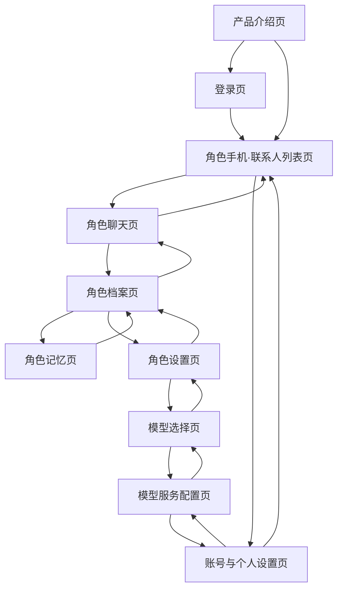
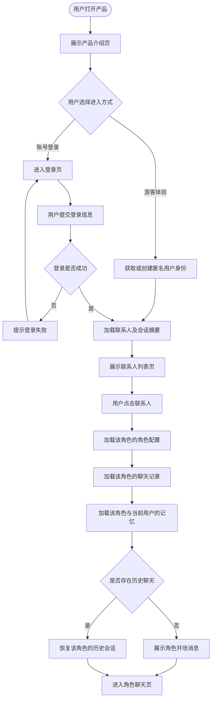
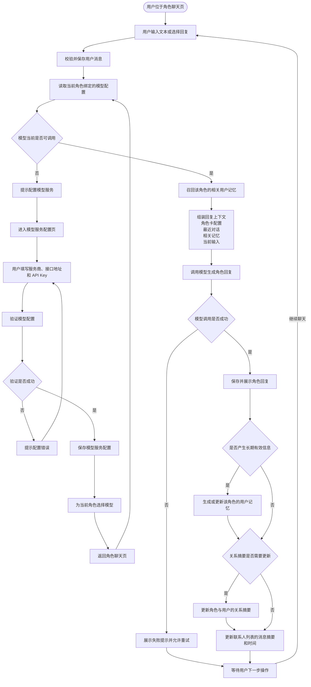
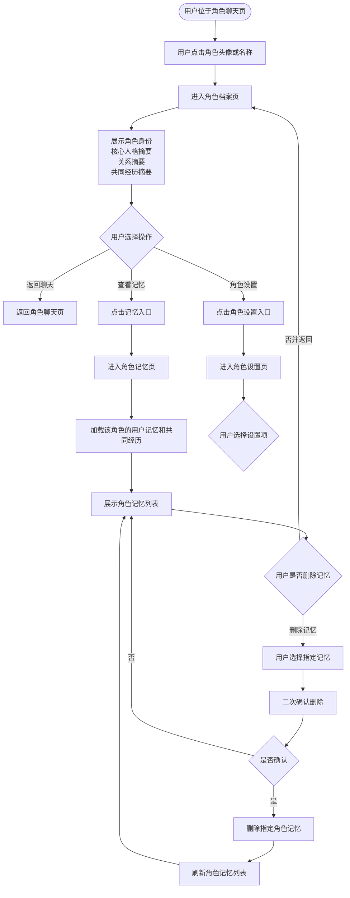
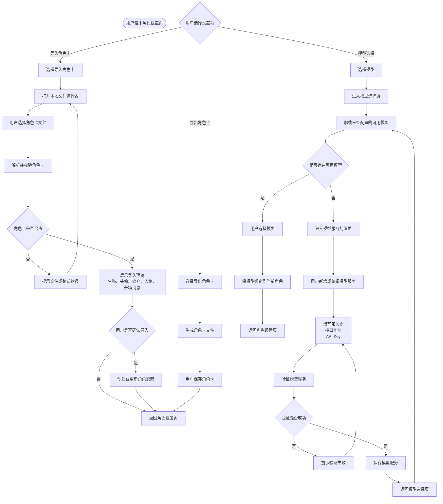

你指出得对。前一版有两个错误：

1. **页面流程图**漏了“角色聊天页 → 角色档案页”，还把启动、身份创建、进入方式等非页面节点混了进去。
2. **交互流程图**只画了聊天生成链路，没有把点击头像进入档案、管理记忆、导入角色卡、选择模型和配置 API Key 的交互补全。

页面流程图应聚焦页面及其流转关系；交互流程则要表达用户操作、系统响应和条件分支。复杂流程适合按具体任务拆开，而不是强行塞进一张超长图。([UXPin][1])

## 一、页面流程图

节点只保留真实页面，不放“启动应用”“游客体验”“进入方式”等过程节点。



对应的页面层级是：

```text
产品介绍页
├── 登录页
└── 角色手机·联系人列表页
    ├── 角色聊天页
    │   └── 角色档案页
    │       ├── 角色记忆页
    │       └── 角色设置页
    │           └── 模型选择页
    └── 账号与个人设置页
        └── 模型服务配置页
```

---

## 二、交互流程图 1：进入产品并打开角色会话



---

## 三、交互流程图 2：角色聊天、模型调用与记忆更新



这里的模型配置规则是：

```text
平台体验额度可用
→ 直接调用平台模型

平台额度不可用或用户主动选择 BYOK
→ 使用用户配置的 API Key

当前角色
→ 只绑定一个已配置模型

API Key
→ 在全局模型服务配置页统一管理
```

---

## 四、交互流程图 3：从聊天进入角色档案



---

## 五、交互流程图 4：角色卡与模型设置



## 原型图核对标准

按照这套流程，原型图必须满足：

```text
联系人列表页
└── 点击联系人进入角色聊天页

角色聊天页
├── 点击角色头像或名称进入角色档案页
└── 不直接常驻展示记忆、角色卡或 API Key 设置

角色档案页
├── 展示角色身份、人格摘要、关系摘要、共同经历摘要
├── 进入角色记忆页
└── 进入角色设置页

角色记忆页
└── 只展示当前角色对当前用户的记忆与共同经历

角色设置页
├── 导入角色卡
├── 导出角色卡
└── 进入模型选择页

模型选择页
├── 选择当前角色使用的模型
└── 没有可用模型时进入模型服务配置页

模型服务配置页
└── 配置服务商、接口地址和 API Key
```

[1]: https://www.uxpin.com/studio/blog/creating-perfect-user-flows-for-smooth-ux/?utm_source=chatgpt.com "Creating Perfect User Flows for Smooth UX"
