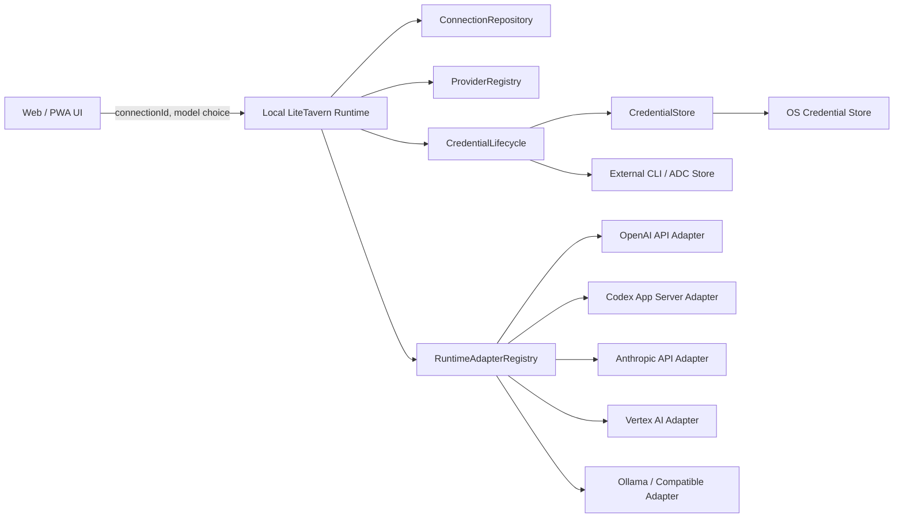

# LiteTavern Provider Connection System 重构设计

> 日期：2026-07-23
> 状态：设计完成，尚未开始生产代码改造
> 目标版本：首期本机优先 Provider Connection 架构

## Clarified Goal

将 LiteTavern 当前固定的“Provider + API Key + Base URL + Model ID”接入方式，逐步迁移为以 `Provider → AuthMethod → Connection → RuntimeAdapter` 为核心的本机连接系统。

普通用户优先看到“使用已有账号”“使用本机已登录服务”“使用本地模型”等低门槛选项；API Key、自定义地址和模型 ID 保留为高级方式。模型请求必须通过具体 `connectionId` 路由，敏感凭证只存在于执行请求的本机可信运行时。

## Scope

### 首期包含

- 一个 Provider 注册多个 AuthMethod。
- 同一 Provider 创建多个 Connection。
- Connection 级模型发现、状态、验证、刷新、重连和删除。
- 本机可信运行时中的统一 CredentialStore。
- RuntimeAdapter 注册表与按 Connection 路由。
- 现有 API Key Provider 的渐进迁移。
- 四类真实通道验证：
  - OpenAI Codex/ChatGPT 订阅账号：浏览器 OAuth 或 Device Code，通过 Codex App Server 运行。
  - Google Vertex AI：复用本机 `gcloud` Application Default Credentials。
  - OpenAI、Anthropic：标准 API Key。
  - Ollama 或自定义 OpenAI-compatible：本地/兼容接口。
- 旧 `model_configuration` 和浏览器 IndexedDB 凭证的受控迁移。
- 普通用户连接流程和高级设置分层。

### 首期不包含

- 云端托管、同步或备份用户凭证。
- 跨设备凭证同步。
- LiteTavern 正式账号体系。
- 电脑关闭后的后台持续运行。
- 一次性实现全部 Provider 和全部 AuthMethod。
- Provider 插件市场或运行时动态加载第三方代码。
- 绕过 Provider 条款复用消费者订阅 OAuth。

## Constraints

1. 本机 Fastify 进程是首期可信运行时；浏览器只负责展示和发起连接，不再长期持有 Secret。
2. Secret 不进入 PGlite、HTTP 响应、日志、错误、埋点、URL、命令行参数或浏览器持久化存储。
3. CredentialStore 不得静默回退到明文文件。操作系统安全存储不可用时，相关 AuthMethod 应显示不可用，并允许 CLI/local 等无 LiteTavern Secret 的方式继续工作。
4. Provider、AuthMethod 和 RuntimeAdapter 是不同维度。OAuth Token、Setup Token、API Key 和 CLI Profile 不可互换。
5. `usage_mode` 暂时保留用于平台额度与用户连接的账本隔离，但不再承担 RuntimeAdapter 路由职责。
6. 继续使用模块化单体，不引入独立认证服务、消息队列或云端凭证服务。
7. 首期安全假设为“单个操作系统用户启动自己的 LiteTavern 本机运行时”；不扩展为多租户主机。
8. 当前数据库只有一段 `CREATE TABLE IF NOT EXISTS` SQL，没有版本化迁移能力。改变表结构前必须先建立迁移版本机制。

## Verified Provider Constraints

### OpenAI

OpenAI 官方文档明确区分 ChatGPT 订阅登录与 API Key 按量计费。Codex App Server 被定义为嵌入自有产品时可使用的本机接口，负责认证、会话和流式 Agent 事件；Device Code 由 `codex login --device-auth` 提供。

因此首期可以用它验证订阅账号 AuthMethod，但必须使用独立的 `openai-codex-app-server` RuntimeAdapter，不能把 Codex OAuth Token 填进标准 OpenAI API Adapter。

限制：Codex SDK/App Server 是 coding-focused Agent 运行时。它可以验证连接架构，但在完成角色聊天质量、模型范围和使用条款验证前，不应无条件标记为 LiteTavern 的默认最佳聊天通道。

来源：

- [OpenAI Codex Authentication](https://learn.chatgpt.com/docs/auth.md)
- [OpenAI Codex App Server](https://learn.chatgpt.com/docs/app-server.md)
- [OpenAI Codex SDK](https://learn.chatgpt.com/docs/codex-sdk.md)

### Anthropic

Anthropic 官方文档允许 Claude Code 用户使用订阅 OAuth，也提供 `claude setup-token`。但是其法律说明明确禁止第三方产品向用户提供 Claude.ai 登录，或代表用户路由 Free、Pro、Max 订阅凭证；开发者产品应使用 Console API Key 或受支持的云平台。

因此：

- 首期支持 Anthropic API Key。
- 保留 `cli` 和 `token` 公共抽象。
- 不把 Claude CLI/Setup Token 作为 LiteTavern 首期真实订阅通道。
- 除非后续获得 Anthropic 明确授权，不实现该路径。

来源：

- [Claude Code Authentication](https://code.claude.com/docs/en/authentication)
- [Claude Code Legal and Compliance](https://code.claude.com/docs/en/legal-and-compliance)

### Google

Gemini CLI 官方条款明确禁止第三方软件直接复用 Gemini CLI 个人 OAuth 后端。Google Cloud Application Default Credentials 则明确用于本机应用调用 Google Cloud API，Vertex AI 官方快速入门支持 `gcloud auth application-default login`。

因此首期 CLI 复用通道选择 Vertex ADC，而不是 Gemini CLI 个人订阅 OAuth。UI 必须明确提示它使用 Google Cloud 项目权限、配额和计费，不应描述为“免费 Google 账号”。

来源：

- [Gemini CLI Terms and Privacy](https://github.com/google-gemini/gemini-cli/blob/main/docs/resources/tos-privacy.md)
- [Google Application Default Credentials](https://docs.cloud.google.com/docs/authentication/application-default-credentials)
- [Vertex AI Gemini Quickstart](https://docs.cloud.google.com/vertex-ai/generative-ai/docs/start/quickstart)

### Ollama

Ollama 提供本机 API 和部分 OpenAI-compatible 接口。它适合验证无 Secret 的 `local` AuthMethod、进程探测、动态模型发现和本机不可用状态。

来源：

- [Ollama OpenAI Compatibility](https://docs.ollama.com/api/openai-compatibility)

## Current Problems

### 1. Provider 同时承担厂商、协议、认证和模型发现

`packages/contracts/src/providers.ts:1-14` 的 `ProviderPreset` 直接包含：

- `protocol`
- `baseUrl`
- `allowCustomBaseUrl`
- `apiKeyRequired`
- `modelDiscovery`

这使 Provider 天然只能拥有一组协议和认证字段。OpenAI API Key 与 Codex OAuth 无法同时表达，因为它们共享 Provider，却使用不同协议、凭证、模型目录和计费方式。

### 2. API 契约把 Credential 固定成 API Key

`packages/contracts/src/schemas.ts:6-10` 的 `transientCredentialSchema` 只有：

```ts
{
  credential_id: string;
  api_key: string;
}
```

`providerConnectionValidationSchema` 在 `packages/contracts/src/schemas.ts:42-49` 强制提交 `base_url`、`model` 和该 API Key Credential；`modelConfigurationInputSchema` 在 `packages/contracts/src/schemas.ts:54-67` 又强制提交 `model_name`、`base_url` 和 `credential_id`。

当前契约无法表示：

- 外部 CLI Profile，不由 LiteTavern读取 Secret。
- OAuth access/refresh/expiry/account。
- Device Code 的待确认流程。
- 无凭证本地模型。
- 具有项目、区域等非 Secret 配置的 Vertex ADC。

### 3. Connection 实际上只是 ModelConfiguration 的别名

`apps/api/src/modules/model-routes.ts:48-93` 直接把“已连接”读取和写入 `model_configuration`。没有独立 Connection 实体，导致：

- 一个连接不能自然共享多个模型配置。
- Connection 状态和模型状态混在一起。
- 同一 Provider 多账号只能伪装成多条模型配置。
- 无处保存 auth method、adapter、账号标签、刷新状态或依赖信息。

### 4. 数据库约束只允许平台凭证或浏览器 API Key

`packages/database/src/migration.ts:84-107` 的 `model_configuration`：

- 强制 `provider`、`model_name`、`base_url`。
- `credential_mode` 只允许 `PLATFORM_MANAGED` 和 `BROWSER_LOCAL`。
- 用户配置必须带 `credential_id`。

没有 Connection 表、Credential 元数据、auth method、runtime adapter 或连接状态。

此外，`packages/database/src/index.ts:12-19` 每次只执行同一段 `CREATE TABLE IF NOT EXISTS`。已有数据库不会因为修改建表 SQL而获得新列或新约束，无法安全完成这次迁移。

### 5. 浏览器 IndexedDB 是真正的 Secret Owner

`apps/web/src/lib/credential-store.ts:15-23` 定义的 `StoredCredential` 直接保存 `apiKey`，`apps/web/src/lib/credential-store.ts:51-57` 打开 IndexedDB，`apps/web/src/lib/credential-store.ts:65-82` 写入完整 Secret。

这与新的“本机可信运行时持有凭证”决策冲突。当前 README、旧计划和测试仍把 IndexedDB 当作正确标准：

- `README.md:34`
- `docs/plans/2026-07-22-feat-litetavern-v0-1-0-plan.md:34,126,139`
- `apps/web/src/lib/credential-store.test.ts:15-28`
- `packages/database/src/database.test.ts:51-65`

这些文档与测试需要在实现阶段按已确认的新产品规则更新，不应继续作为正确标准。

### 6. Secret 每轮从浏览器传入 API

`apps/web/src/App.tsx:89-101` 在发送消息前从 IndexedDB 读取 Key，并把它放入生成请求。

API 的 `apps/api/src/modules/generation-routes.ts:110-147`：

- 只查询 `credential_mode = 'BROWSER_LOCAL'`。
- 校验请求中的 `credential_id`。
- 从请求中的 `credential.api_key` 构造执行输入。

回复建议在 `apps/api/src/modules/generation-routes.ts:353-397` 又复制了一遍相同分支。增加任何新认证方式都会同时修改主生成、建议生成和其他未来入口。

### 7. ModelGateway 输入和分支仍以 apiKey 为中心

`apps/api/src/modules/providers/model-gateway.ts:8-13` 的公共输入固定包含 `apiKey: string`。

`apps/api/src/modules/providers/model-gateway.ts:41-60` 在一个函数内按 Provider protocol 选择 AI SDK，并把所有其他 Provider 当成 OpenAI-compatible。`apps/api/src/modules/providers/model-gateway.ts:102-128` 又手工拼接三种认证 Header。

这会导致：

- AuthMethod 与 RuntimeAdapter 无法独立组合。
- OAuth Token 容易被错误当成 Bearer API Key。
- 新协议需要修改核心 `if` 分支。
- 模型发现被错误假设成 Provider 级固定行为。

### 8. 错误模型无法驱动 Connection 状态

`apps/api/src/modules/providers/model-gateway.ts:186-197` 通过错误文本猜测 401、403、429 和 timeout，并把认证错误统一提示为“检查 API Key”。

当前无法区分：

- Access Token 到期且可刷新。
- Refresh Token 被撤销。
- CLI 未安装或已退出登录。
- 本地模型服务未启动。
- 临时网络不可用。
- 需要用户重新连接。

### 9. 删除流程不是 Connection 生命周期

`apps/web/src/components/ProviderSettings.tsx:111-115` 并行删除浏览器凭证和服务端模型配置。没有：

- Provider remote revoke。
- Secret Store 原子删除。
- 状态更新。
- 部分失败恢复。
- Connection 下多个模型配置的处理。

### 10. UI 默认暴露技术配置

`apps/web/src/components/ProviderSettings.tsx:18-21` 把 `baseUrl`、`model`、`apiKey` 作为固定状态；`apps/web/src/components/ProviderSettings.tsx:138-149` 对所有 Provider 展示 Base URL、模型 ID 和 API Key。

用户必须先理解 Provider API 概念，才能建立任何连接，违反新的低学习成本原则。

### 11. 本机运行边界存在，但尚未形成可信桌面宿主

`apps/api/src/server.ts:3-8` 只监听 `127.0.0.1`，可以作为本机可信运行时的基础。

但当前仍是分离的 Vite PWA 与 Fastify：

- `apps/web/vite.config.ts:28-34` 开发时代理到本机 API。
- `apps/api/src/app.ts:67-75` 允许一个 Web Origin。
- `apps/api/src/app.ts:78-99` 对有 Origin/Referer 的写请求做来源检查，但无浏览器来源头的 native/API client 仍被允许。
- 没有操作系统 Secret Store、桌面进程生命周期、同源生产托管或本机 capability token。

在增加凭证管理 API 前，需要强化本机调用边界，不能仅依赖“端口在 localhost”。

### 12. 当前测试基线并非全绿

本轮只读基线结果：

- API：26 tests passed。
- Contracts：7 tests passed。
- Database：4 tests passed。
- Web：6 tests 中 1 个失败，`apps/web/src/App.test.tsx:56` 的 accessible name 预期与当前按钮名称不一致。
- Typecheck 失败：`ModelGateway.complete()` 已成为必需方法，但 `apps/api/src/app.test.ts:136` 和 `apps/api/src/generation.test.ts:28` 的测试替身未实现它。

开始 Provider 重构前应先恢复基线，避免把已有失败误归因于新架构。

## Target Design

### Architecture Overview



核心依赖方向：

```text
HTTP Routes
  → ConnectionService / GenerationService
    → ProviderRegistry + ConnectionRepository
    → CredentialLifecycle
    → RuntimeAdapterRegistry

Adapter 和 AuthMethod 可以依赖 Provider SDK。
核心 ConnectionService 不依赖任何具体 Provider SDK。
```

### 1. ProviderDefinition

Provider 只表达厂商身份和用户可见信息，不再包含唯一协议或唯一凭证形式。

```ts
interface ProviderDefinition {
  id: string;
  displayName: string;
  category: "global" | "cn" | "local" | "custom";
  authMethods: readonly AuthMethodDefinition[];
}
```

### 2. AuthMethodDefinition

```ts
type AuthMethodKind =
  | "oauth"
  | "device_code"
  | "api_key"
  | "token"
  | "cli"
  | "local"
  | "custom";

interface AuthMethodDefinition {
  id: string;
  kind: AuthMethodKind;
  display: {
    title: string;
    description: string;
    group: "recommended" | "other";
    usesExistingSubscription: boolean;
    additionalBilling: "none" | "provider_quota" | "usage_based" | "unknown";
    credentialLocation: string;
    requiresLocalSoftware?: string;
    modelScope: string;
  };
  runtimeAdapterId: string;
  credentialOwner: "litetavern" | "external" | "none";
  connectionConfigSchema: ZodType;
  credentialSchema?: ZodType;
  probe?: () => Promise<AuthMethodAvailability>;
}
```

`connectionConfigSchema` 只描述该方式真实需要的非 Secret 配置。例如：

- OpenAI API Key：通常没有额外配置。
- Vertex ADC：`projectId`、`location`。
- Ollama：高级设置中可覆盖 endpoint。
- Custom compatible：`baseUrl`、协议变体、可选模型 ID。

核心系统不提前增加 provider-specific 列。

### 3. ProviderConnection

```ts
type ConnectionStatus =
  | "connected"
  | "expired"
  | "revoked"
  | "unavailable"
  | "reconnect_required";

interface ProviderConnection {
  id: string;
  providerId: string;
  authMethodId: string;
  displayName: string;
  status: ConnectionStatus;
  nonSecretConfig: Record<string, unknown>;
  credentialRef?: string;
  lastCheckedAt?: string;
  lastErrorCode?: string;
  createdAt: string;
  updatedAt: string;
}
```

同一个 Provider 可拥有任意多个 Connection。Connection ID 是模型调用路由键，不再把 Provider ID 当成账号或运行通道。

首期 Connection 归属于当前操作系统用户的本机 LiteTavern Runtime，不上传云端。为避免扩大身份范围，暂不引入 LiteTavern Account。

### 4. Credential Metadata 与 Secret 分离

PGlite 只保存非 Secret 元数据：

```ts
interface CredentialMetadata {
  credentialRef: string;
  connectionId: string;
  kind: AuthMethodKind;
  store: "os_keyring" | "external_cli" | "none";
  version: number;
  expiresAt?: string;
  updatedAt: string;
}
```

Secret Payload 只存在于本机安全存储，可由每个 AuthMethod 定义不同 schema：

```text
API Key:
  { apiKey }

OAuth:
  { accessToken, refreshToken?, accountId?, scopes? }

Token:
  { token }

External CLI:
  无 LiteTavern Secret，只保存外部 profile locator

Local:
  无 Secret
```

CredentialStore 只负责安全存储，不负责 Provider 网络协议：

```ts
interface CredentialStore {
  save(ref: string, payload: Uint8Array): Promise<{ version: number }>;
  read(ref: string): Promise<{ payload: Uint8Array; version: number } | null>;
  compareAndSwap(
    ref: string,
    expectedVersion: number,
    payload: Uint8Array
  ): Promise<{ version: number }>;
  delete(ref: string): Promise<void>;
}
```

Provider-specific refresh、revoke 和 reconnect 由 `CredentialLifecycle` 调用 AuthMethod handler 完成：

```ts
interface AuthLifecycleHandler {
  validate(context: AuthContext): Promise<AuthValidation>;
  refresh?(context: AuthContext): Promise<UpdatedCredential>;
  revoke?(context: AuthContext): Promise<void>;
  reconnect(context: ReconnectContext): Promise<ConnectionResult>;
}
```

这种拆分满足统一生命周期，同时避免把 OAuth HTTP 逻辑塞进 Secret Store。

### 5. 原子 Refresh Token 轮换

首期刷新流程：

1. 获取 `connectionId` 级 single-flight 锁。
2. 重新读取最新 Credential 和 version。
3. 再次检查 expiry，避免重复刷新。
4. 调用当前 AuthMethod 的 refresh handler。
5. 使用 `compareAndSwap(expectedVersion)` 原子替换完整 Credential Envelope。
6. CAS 冲突时丢弃当前刷新结果并重新读取，不得覆盖更新后的 refresh token。
7. Secret 成功写入后更新 Connection 元数据。
8. 刷新失败且需要用户操作时，将 Connection 更新为 `reconnect_required`。

Secret Store 与 PGlite 不能做跨存储事务，因此 Secret 是刷新结果的事实源；Connection 状态更新失败时，下次读取通过 Credential 自检修复元数据。

### 6. Connection 状态语义

| 当前状态 | 事件 | 下一状态 | 处理 |
| --- | --- | --- | --- |
| connected | Access Token 到期 | expired | 进入刷新 |
| expired | 刷新成功 | connected | 原子替换 Credential |
| expired | refresh 失败/invalid_grant | reconnect_required | 提示重新连接 |
| connected | Provider 明确撤销 | revoked | 禁止继续调用 |
| connected | CLI 未启动、依赖缺失、endpoint 临时离线 | unavailable | 可自动重试或启动依赖 |
| unavailable | 探测恢复 | connected | 刷新模型目录 |
| 任意 | Secret 缺失或损坏 | reconnect_required | 不回退到其他 Connection 或平台 Key |
| revoked/reconnect_required | 用户重新认证成功 | connected | 保留 Connection ID，替换凭证 |

认证失败必须先更新 Connection 状态，再返回结构化错误。不得只返回通用 `PROVIDER_UNAVAILABLE`。

### 7. RuntimeAdapter

```ts
interface RuntimeAdapter {
  id: string;
  validate(context: ConnectionRuntimeContext): Promise<ConnectionHealth>;
  listModels(context: ConnectionRuntimeContext): Promise<AvailableModel[]>;
  stream(
    context: ConnectionRuntimeContext,
    request: GenerationInput
  ): Promise<GenerationStream>;
  complete(
    context: ConnectionRuntimeContext,
    request: GenerationInput
  ): Promise<GenerationResult>;
}
```

`ConnectionRuntimeContext` 包含已经验证的 Connection、非 Secret 配置和短生命周期 Credential Lease。HTTP Route、聊天模块和模型配置模块都看不到 Secret 字段。

Adapter 通过注册表解析：

```ts
adapterRegistry.get(authMethod.runtimeAdapterId)
```

禁止在核心路由中按 `providerId` 或 `authMethod.kind` 增加大段分支。

### 8. 首期 Adapter 与 AuthMethod

| Provider | AuthMethod | Credential Owner | RuntimeAdapter | 用户成本说明 |
| --- | --- | --- | --- | --- |
| OpenAI | `codex-device-code` | Codex/OS store | `openai-codex-app-server` | 使用符合条件的 ChatGPT/Codex 订阅；模型和限制与 API 不同 |
| OpenAI | `codex-cli` | external CLI | `openai-codex-app-server` | 复用本机已登录 Codex；依赖本机 Codex |
| OpenAI | `api-key` | LiteTavern OS store | `openai-api` | OpenAI Platform 按量计费 |
| Anthropic | `api-key` | LiteTavern OS store | `anthropic-api` | Anthropic Console 按量计费 |
| Google Vertex | `gcloud-adc` | external ADC | `vertex-ai` | 使用 Google Cloud 项目、IAM、配额和计费 |
| Ollama | `local` | none | `ollama` | 本机算力；需启动 Ollama |
| Custom | `openai-compatible` | optional LiteTavern OS store | `openai-compatible` | 高级方式；费用和模型由目标服务决定 |

`codex-device-code` 和 `codex-cli` 可共享同一 RuntimeAdapter，但它们的 onboarding、credential ownership 和可用性探测不同。

### 9. Connection 级模型目录

模型目录必须由 Connection 的 Adapter 返回：

```ts
interface AvailableModel {
  id: string;
  displayName: string;
  capabilities: string[];
  contextWindow?: number;
  recommended?: boolean;
  billingNote?: string;
}
```

例如 OpenAI API Key 与 OpenAI Codex 订阅 Connection 即使属于同一 Provider，也拥有不同模型目录。

默认连接流程：

1. 建立 Connection。
2. Adapter 验证并发现模型。
3. 自动选择 `recommended` 模型。
4. 普通用户只看到可读名称。
5. 手工 Model ID 只在 AuthMethod 不支持发现或用户进入高级设置时出现。

### 10. Generation 路由

目标请求不再携带 Secret：

```ts
{
  usage_mode: "BYOK",
  connection_id: "uuid",
  model_id?: "provider-model-id",
  input: { type: "text", text: "..." }
}
```

渐进期可以继续接受 `model_configuration_id`，但服务端必须先解析出 `connection_id`，再由 `ConnectionRuntime` 选择 Adapter 和 Credential。

`usage_mode` 继续决定平台额度/用户连接的账本分类；`connection_id` 决定实际执行通道。两者职责不再混合。

主生成和回复建议都调用同一个 `ConnectionRuntime.resolveExecution()`，删除当前重复的 Credential 分支。

### 11. Local API

建议新增：

```text
GET    /v1/providers
GET    /v1/provider-connections
POST   /v1/provider-connections/:providerId/:authMethodId/start
POST   /v1/provider-connections/:connectionId/complete
POST   /v1/provider-connections/:connectionId/validate
GET    /v1/provider-connections/:connectionId/models
POST   /v1/provider-connections/:connectionId/refresh
POST   /v1/provider-connections/:connectionId/reconnect
DELETE /v1/provider-connections/:connectionId
```

`start` 返回用户下一步，而不是暴露 OAuth 实现细节：

```ts
type ConnectionNextAction =
  | { kind: "open_browser"; url: string }
  | { kind: "show_device_code"; userCode: string; verificationUrl: string }
  | { kind: "enter_secret"; fields: UserFacingField[] }
  | { kind: "install_dependency"; dependency: string }
  | { kind: "wait_for_local_service"; service: string }
  | { kind: "done"; connectionId: string };
```

安全要求：

- 本机 Runtime 继续只监听 loopback。
- 生产模式由 Runtime 同源托管 Web 资源，减少跨端口信任边界。
- Credential 变更接口要求 HttpOnly session + CSRF/capability 校验。
- OAuth callback 校验 PKCE、state、一次性 auth session 和超时。
- Callback、日志和错误不记录 code、token 或完整 URL query。
- 任何自定义 endpoint 继续执行 SSRF/private-network policy；只有明确标记为 local 的 AuthMethod 可访问 loopback/private endpoint。

### 12. UI 信息架构

默认入口：

```text
连接 AI 服务

推荐方式
  使用已有账号
  使用本机已登录服务
  使用本地模型

其他方式
  使用 API Key
  自定义兼容接口
```

Provider 详情按 AuthMethod 动态展示以下用户信息：

- 是否使用已有订阅。
- 是否可能额外按量计费。
- 凭证保存在何处。
- 是否依赖 Codex、gcloud、Ollama 等本机软件。
- 可用模型范围。
- 当前连接状态和可执行操作。

默认页不展示 OAuth、Device Code、Refresh Token、Base URL、Model ID 等术语。技术名称只在高级信息、诊断或用户必须执行的步骤中出现。

## Data Model

建议新增：

```text
provider_connection
  connection_id UUID PK
  provider_id VARCHAR(80)
  auth_method_id VARCHAR(100)
  display_name VARCHAR(120)
  status VARCHAR(30)
  config_json JSONB
  last_checked_at TIMESTAMPTZ NULL
  last_error_code VARCHAR(80) NULL
  created_at / updated_at / deleted_at

provider_credential_metadata
  credential_ref VARCHAR(160) PK
  connection_id UUID FK UNIQUE
  kind VARCHAR(30)
  store VARCHAR(30)
  version INTEGER
  expires_at TIMESTAMPTZ NULL
  updated_at

provider_model_catalog
  connection_id UUID FK
  model_id VARCHAR(240)
  metadata_json JSONB
  discovered_at TIMESTAMPTZ
  PRIMARY KEY(connection_id, model_id)
```

修改 `model_configuration`：

```text
新增 connection_id UUID NULL
旧 provider/base_url/credential_mode/credential_id 暂时保留
```

首期不创建保存密文的 PGlite 列；`provider_credential_metadata` 只保存 opaque ref 和非 Secret 元数据。

## Migration Plan

### Phase 0：恢复基线并建立版本化迁移

1. 修复现有测试替身缺少 `complete()` 的类型错误。
2. 确认并修复现有 Web accessible-name 测试或实现偏差。
3. 把单一 `MIGRATION_SQL` 改造成有 migration ledger 的顺序迁移。
4. 增加“从旧数据库启动并升级”的持久化迁移测试。

这一阶段不改变 Provider 用户行为。

### Phase 1：建立最小公共接口

1. 新增 Provider/AuthMethod 定义。
2. 新增 Connection repository 和表。
3. 新增 RuntimeAdapterRegistry。
4. 新增 CredentialStore、CredentialLifecycle 和内存测试实现。
5. 新增 Connection 状态机。
6. 现有 ModelGateway 先包装成 legacy adapter，保证原路径继续工作。

### Phase 2：迁移现有 API Key

1. 将现有 OpenAI-compatible、OpenAI、Anthropic、Google API Key 注册为 AuthMethod。
2. 把现有 AI SDK 调用拆成 Adapter。
3. 把 API Key 写入 OS Credential Store，不再写入 IndexedDB。
4. 生成请求改为传 `connection_id`，服务端本机 Runtime 读取 Secret。
5. 平台官方额度路径保持隔离，不允许用户 Connection 回退到平台 Key。

### Phase 3：迁移旧配置与浏览器 Secret

旧 `model_configuration` 映射：

```text
ollama / lmstudio
  → local AuthMethod

custom-openai
  → custom/openai-compatible AuthMethod

其他已有 Provider
  → api-key AuthMethod
```

迁移步骤：

1. 为每条旧用户配置创建 Connection，初始为 `reconnect_required`。
2. 保留原模型名和 endpoint，回填 `model_configuration.connection_id`。
3. 同一浏览器检测到旧 IndexedDB Secret 时，展示一次性本机迁移确认。
4. 浏览器只通过同源 loopback API 把 Secret 导入本机安全存储。
5. Runtime 保存并验证成功后，浏览器删除对应 IndexedDB Secret。
6. 如果旧 Secret 已不可用，保留配置和模型信息，要求用户重新输入；不回退到平台凭证。
7. 迁移完成后，浏览器只保留非敏感 UI 偏好。

这一步无法在没有原浏览器 Secret 的设备上做到无感恢复；这是旧架构的固有限制，不属于跨设备同步范围。

### Phase 4：真实通道验证

按以下顺序接入：

1. Ollama `local`：验证无 Secret、进程探测、模型发现和 unavailable 恢复。
2. OpenAI/Anthropic `api-key`：验证 OS Secret Store、标准 API Adapter 和计费说明。
3. Google Vertex `gcloud-adc`：验证 external credential owner、结构化非 Secret 配置和 CLI/ADC 复用。
4. OpenAI Codex `codex-cli`/`codex-device-code`：验证订阅认证、不同模型目录和独立 RuntimeAdapter。

先实现最容易验证和回归的本地/API Key，再接入外部 CLI 与订阅运行时。

### Phase 5：UI 分层

1. Provider 列表改为 Connection onboarding。
2. 动态探测已登录 CLI、本地服务和可用 AuthMethod。
3. 默认推荐低门槛方式。
4. API Key、自定义 endpoint、手工 model 进入“其他方式/高级设置”。
5. 已连接卡片显示账号/来源、计费、凭证位置、模型范围和状态。

UI 实施时必须遵循项目设计技能与原型还原门禁；本设计不修改现有视觉语言。

### Phase 6：删除确认无引用的旧分支

满足以下条件后才删除：

- 新请求不再提交 `credential.api_key`。
- 生成和回复建议只使用统一 ConnectionRuntime。
- IndexedDB Secret 已迁移或明确进入 reconnect。
- 所有 Provider 都已转为 AuthMethod + Adapter。
- 旧兼容 API 有迁移期和弃用测试。
- 代码搜索确认旧 `BROWSER_LOCAL` 执行分支无引用。

## Test Plan

遵循“确认规则 → 先写测试 → 修改生产代码 → 相关测试 → 全量检查”。

### Contract / Registry

- 一个 Provider 可注册多个 AuthMethod。
- AuthMethod ID 在 Provider 内唯一。
- AuthMethod 引用的 RuntimeAdapter 必须已注册。
- 新增测试 Provider + Adapter 不需要修改核心认证分支。
- 面向 UI 的 Provider DTO 不包含 credential schema 或 Secret。

### Connection / Repository

- 同一 Provider 可创建多个 Connection。
- 不同 Connection 保存独立 auth method、状态、配置和 credential ref。
- Connection 删除后模型目录、配置引用和 credential metadata 正确处理。
- Connection 不因相同 Provider ID 被错误合并。

### Adapter Routing

- OpenAI API Key Connection 只选择 `openai-api`。
- OpenAI Codex Connection 只选择 `openai-codex-app-server`。
- API Key 与 OAuth Credential 不会走错执行通道。
- Vertex ADC 只选择 `vertex-ai`，且不要求 API Key。
- Ollama local 不读取 CredentialStore。
- 未注册 Adapter 返回结构化配置错误，不回退到兼容 Adapter。

### Credential Lifecycle

- API Key 保存、读取、更新和删除。
- Credential payload 不要求统一字段。
- 到期 OAuth Credential 触发一次刷新。
- 并发请求只执行一次 refresh。
- Refresh Token 轮换使用 CAS 原子更新。
- 旧 refresh 结果不能覆盖新版本。
- refresh 成功后状态恢复 connected。
- refresh 失败后状态变为 reconnect_required。
- revoked 响应变为 revoked。
- Secret 缺失变为 reconnect_required，且不回退到平台凭证。
- 删除 Connection 后本机 Secret 同步删除。
- remote revoke 失败时仍删除本机 Secret，并返回可见 warning。

### External Credential

- 已登录 Codex CLI 可被 probe，但 LiteTavern 不复制其 Secret。
- Codex CLI 退出登录后 Connection 变为 reconnect_required 或 unavailable。
- gcloud ADC 存在时 Vertex Connection 可验证。
- ADC 缺失时返回安装/登录操作，不读取任意用户文件内容。
- 外部工具自行刷新时 LiteTavern 重新探测，不写回其 Credential Store。

### Database Migration

- 新数据库创建 Connection 新表。
- 旧数据库可按版本顺序升级。
- 迁移重复执行保持幂等。
- 旧 API Key Provider 配置映射到正确 AuthMethod。
- 旧 Ollama/custom 配置映射到 local/custom。
- 旧配置保留显示名、模型、endpoint。
- Secret 未迁移时状态为 reconnect_required。
- Secret 成功导入后旧 IndexedDB 记录被删除。
- PGlite 不出现 access token、refresh token、API Key 或密文 payload。

### API

- 创建 Connection 不要求统一 `api_key` 字段。
- Device Code start/complete 校验 state、expiry 和单次使用。
- Generation 请求只需要 connection_id，不接收 Secret。
- 非所属/不存在 Connection 返回 404，不泄露元数据。
- 状态错误返回明确的 connection status 和 reconnect action。
- 删除操作幂等。
- 自定义 endpoint 继续阻止非授权 private network/危险 URL。

### UI / Core E2E

- 默认页首先显示“使用已有账号/本机已登录服务/本地模型”。
- 默认页不出现 Refresh Token、Base URL 或 Model ID。
- API Key 和自定义接口仍可从“其他方式”进入。
- 已有本机登录时显示可直接使用。
- 每种方式展示订阅、额外计费、保存位置、本机依赖和模型范围。
- Connection 失效后显示重新连接，而不是“API Key 错误”。
- 关键流程：
  - Ollama 自动发现并聊天。
  - API Key 保存到本机运行时并聊天。
  - Vertex ADC 复用并聊天。
  - Codex Device Code 登录、发现模型并调用正确 Adapter。

### Security

- HTTP 请求、响应、日志、错误、数据库和前端状态中均无完整 Secret。
- OAuth callback 不记录 code/token/query。
- 浏览器持久化中无 API Key、access token、refresh token。
- Refresh 并发与进程中断不会恢复旧 token。
- Credential endpoint 拒绝跨来源和缺少本机 capability 的请求。
- 自定义 endpoint 的 SSRF 回归测试继续通过。
- Provider 错误不会把 Secret 拼入 message。

### Baseline Verification Commands

实施阶段每批至少运行：

```powershell
npm.cmd run test --workspace @litetavern/contracts
npm.cmd run test --workspace @litetavern/database
npm.cmd run test --workspace @litetavern/api
npm.cmd run test --workspace @litetavern/web
npm.cmd run typecheck
npm.cmd run lint
npm.cmd run build
```

阶段完成时运行：

```powershell
npm.cmd run check
```

真实 Provider 验证使用用户主动提供/已有的本机凭证，只运行最小模型发现与短回复测试，不把外部调用测试混入默认离线测试套件。

## Risks and Mitigations

### Codex 不是通用角色聊天 API

风险：Codex App Server 面向 coding-focused Agent，角色聊天质量、系统提示遵循和可用模型可能与标准 OpenAI API 不同。

措施：作为独立 AuthMethod/Adapter 标记；先做 capability spike 和最小真实验证，不与 OpenAI API 模型目录混合，不承诺等价体验。

### OS Secret Store 跨平台实现

风险：当前 Node 项目没有 keyring 依赖，Windows、macOS、Linux 的安全存储能力不同。

措施：先实现 CredentialStore 合同与内存测试；实现阶段选择维护活跃的 OS keyring binding。不可用时 fail closed，不回退到明文文件。首个支持平台必须在实现任务开始前固定并记录。

### 外部 CLI 版本漂移

风险：Codex App Server JSON-RPC schema、CLI 状态命令和模型目录随版本变化。

措施：Adapter 探测版本与能力；固定最低兼容版本；使用 CLI 生成的版本对应 schema；不可兼容时标记 unavailable 并给出升级提示。

### Connection 与旧 ModelConfiguration 双写

风险：渐进迁移期间两个来源可能漂移。

措施：Connection 成为新事实源；旧列仅作兼容快照。所有写入先由单一 ConnectionService 完成，并用迁移/一致性测试覆盖。

### 本机 HTTP 边界

风险：loopback API 仍可能被恶意网页、DNS rebinding 或本机其他进程探测。

措施：同源托管、严格 Origin、HttpOnly/SameSite Cookie、CSRF/capability、OAuth state/PKCE、禁止非 loopback 监听、Credential API 不接受 Secret 查询参数。

## Definition of Done

1. Provider 定义不再包含“唯一 API Key 认证”的假设。
2. 同一 Provider 可以注册多个 AuthMethod。
3. 同一 Provider 可以持有多个独立 Connection。
4. 每次模型调用最终按 Connection 选择 RuntimeAdapter。
5. OpenAI API Key 与 Codex OAuth 使用不同 Adapter 和模型目录。
6. 敏感凭证只存在于本机可信运行时或 Provider 官方外部 Credential Store。
7. 浏览器 LocalStorage、IndexedDB 和前端状态不长期保存 Secret。
8. Credential 支持安全保存、读取、原子更新、删除和过期元数据。
9. Auth 生命周期支持验证、刷新、撤销、重新连接和状态落库。
10. 并发刷新不会用旧 Refresh Token 覆盖新 Token。
11. 刷新失败会将 Connection 标记为 reconnect_required。
12. 删除 Connection 会删除对应本机 Secret。
13. 普通用户默认不需要填写 Base URL 或 Model ID。
14. API Key 与自定义兼容接口仍作为高级方式可用。
15. OpenAI Codex、Vertex ADC、API Key、Ollama/Compatible 四类真实通道通过最小验证。
16. Anthropic API Key 保持可用，未违规引入 Claude.ai 订阅 OAuth。
17. 旧 Provider 配置可迁移；无法取得旧 Secret 时明确提示重连，不静默丢失或回退。
18. 新增 Provider/AuthMethod/Adapter 不需要修改核心认证与生成条件分支。
19. 平台官方凭证与用户 Connection 继续严格隔离。
20. 相关单元、状态、迁移、API、安全和核心 E2E 测试通过，完整 `npm.cmd run check` 通过。

## Open Questions

没有阻塞本设计的产品问题。

实现前仍需完成两个限定技术 Spike：

1. 选定首个正式支持的操作系统及对应 OS keyring binding；这不改变 CredentialStore 合同。
2. 用短提示验证 Codex App Server 是否能满足 LiteTavern 角色聊天的最低文本质量和控制要求；若不满足，只影响该 AuthMethod 的首期可用性，不影响公共架构。

## 当前实施说明（2026-07-23）

- Phase 1 保留并冻结，作为暂未接入现有 Web/PWA 与 BYOK 执行路径的兼容基础。
- Phase 2～6 暂停，当前不实施 PC/Local Runtime、系统凭证存储、真实 OAuth 或 Provider 新 UI。
- 当前优先验证默认 AI、角色、记忆、关系与迁移体验。
